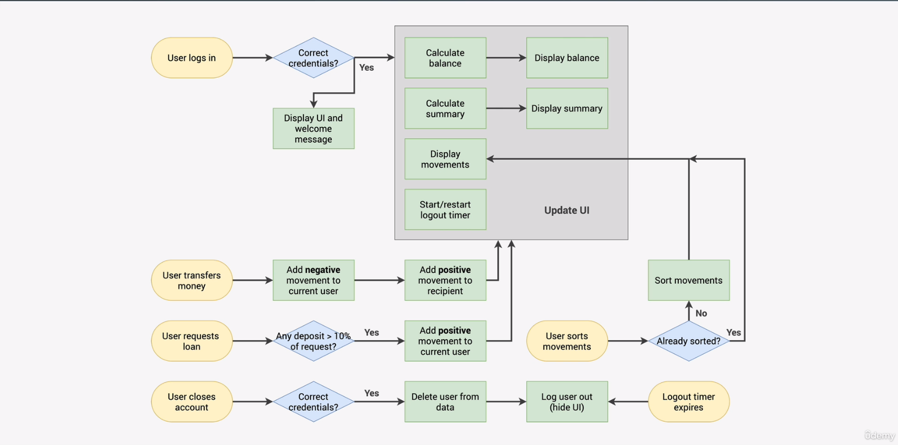
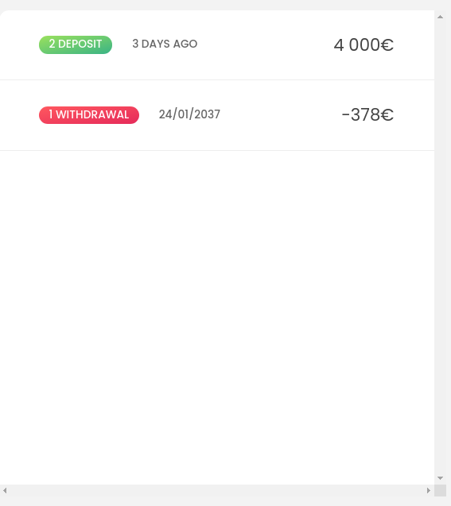
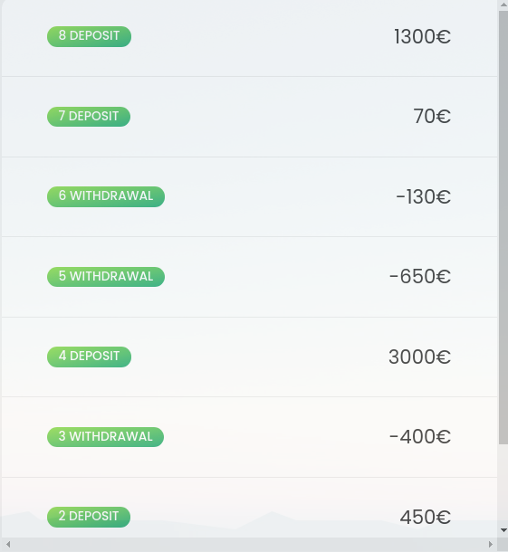

# 011 - WORKING WITH ARRAYS

## 11.141: SIMPLE ARRAY METHODS

Methods are functions that we can call on objects.
They are attached to objects.

`Arrays` are objects and they access to some special methods that we can use as
tools on the arrays.

### SLICE METHODS

With the `slice()` method, we can extract a part of an array without changing
the original array.

So, with the function call `arr.slice(i,j)` (on an array called `arr`), it will
return a new array copy with the items `i` up until `j-1` from the original
array. Please note that the slice method will not in anyway change the original
array.

Examples:

```javascript
let arr = ['a', 'b', 'c', 'd', 'e'];
console.log(arr.slice(2)); // ['c', 'd', 'e']
console.log(arr.slice(2, 4)); // ['c', 'd']
console.log(arr.slice(-2)); // ['d', 'e']
console.log(arr.slice(1, -2)); // ['b', 'c']
console.log(arr.slice()); // Same as console.log([...arr]);
```

### SPLICE METHOD

The `splice()` method works almost in the same way as the `slice()` method. The
main difference is that the `splice()` method changes the underlying array. So,
the `splice()` method returns the elements that are to be extracted and deletes
them from the original array. You could see this method as if we want to "carve
out" some elements from the original array.

```javascript
let arr = ['a', 'b', 'c', 'd', 'e'];
console.log(arr.splice(2)); // ['c', 'd', 'e']
console.log(arr); // ['a', 'b']
```

One common use case is to pop off the last element of an array:

```javascript
let arr = ['a', 'b', 'c', 'd', 'e'];
console.log(arr.splice(-1)); // ['e']
console.log(arr); // ['a', 'b', 'c', 'd']
```

The syntax is also little different with respect of the arguments, so the method
call `arr.splice(i, j)` means that starting from element i, the splice method
will return and cut off the next `j` elements (including element `i`);

Example:

```javascript
let arr = ['a', 'b', 'c', 'd', 'e'];
console.log(arr.splice(1, 3)); // ['b', 'c', 'd']
console.log(arr); // ['a', 'e']
```

### REVERSE METHOD

The `reverse()` method reverses the order of an array and returns that
array.Please note that the `reverse()` method mutates (changes) the original
array and returns a reference to the same changed array.

Example:

```javascript
const arr2 = ['j', 'i', 'h', 'g', 'f'];
console.log(arr2.reverse()); // ['f', 'g', 'h', 'i', 'j']
console.log(arr2); // ['f', 'g', 'h', 'i', 'j']
```

### CONCATENATE METHOD

The concatenate method merges the contents of two arrays and returns it. please
note that it doesn't mutate the original array i.e. the original array stays the
same.

```javascript
arr = ['a', 'b', 'c', 'd', 'e'];
arr2 = ['j', 'i', 'h', 'g', 'f'];
const letters = arr.concat(arr2);
console.log(letters); // ['a', 'b', 'c', 'd', 'e', 'j', 'i', 'h', 'g', 'f']
console.log(arr); // ['a', 'b', 'c', 'd', 'e']

const letters2 = [...arr, ...arr2]; // Exactly the same as the concat method
console.log(letters2); // ['a', 'b', 'c', 'd', 'e', 'j', 'i', 'h', 'g', 'f']
```

Also note that the results of the `concat()` method can be achieved with
`[...arr1, ...arr2]`.

### JOIN METHOD

The join method converts an array to a string where a specified separator binds
the array elements together. Please note that the `join` method doesn't change
the underlying array.

Example:

```Javascript
const arr = ['a', 'b', 'c'];
const strArr = arr.join(arr, '-')
console.log(strArr); // "a-b-c"
```

## 10.142 LOOPING ARRAYS WITH: `forEach()`

As in the same way as with the `for (const arrElement of arr)`, you can also use
the `forEach()` method to loop over arrays.

This could be best illustrated with these examples:

Example 1 (With `for of`):

```javascript
// Pos: deposit - Neg: Withdrawal
// movements = bank account movements
const movements = [200, 450, -400, 3000, -650, -130, 70, 1300];
for (const [i, movement] of movements.entries()) {
    if (movement > 0) {
        console.log(`Movement ${i + 1}: You deposited ${movement}`);
    } else {
        console.log(`Movement ${i + 1}: You withdraw ${Math.abs(movement)}`);
    }
}
```

Example 2 (with `forEach`)

```javascript
// positive value: deposit - negative value: withdrawal
// movements = bank account movements
const movements = [200, 450, -400, 3000, -650, -130, 70, 1300];

movements.forEach((movement, i, array) => {
    /*
The names of the arguments doesn't matter but the order does - the i is the
index, the array is the array which we are looping over and movement is the
current array element. Please note that the i and array are optional. These
values doesn't need to be provided if you don't need them.
*/
    if (movement > 0) {
        console.log(`Movement ${i + 1}: You deposited ${movement}`);
    } else {
        console.log(`Movement ${i + 1}: You withdraw ${Math.abs(movement)}`);
    }
});
```

One main difference with the `for of` and `forEach()` method is that you cannot
use `break` and `continue` inside the `forEach()` method.

## 10.143 `forEach` WITH MAPS AND SETS

### MAPS

This basically works as the same way as with arrays (please see prior chapter).
Best illustrated with an example:

```javascript
const currencies = new Map([
    ['USD', 'United States dollar'],
    ['EUR', 'Euro'],
    ['GBP', 'Pound sterling'],
]);

currencies.forEach((value, key, map) => {
    console.log(`${key}: ${value}`);
});
```

Output:

```
USD: United States dollar
script.js:179 EUR: Euro
script.js:179 GBP: Pound sterling
```

### SETS

The `forEach` method exists also on sets but with the difference that sets does
neither have any index or key. So the `key` in the callback fucntions returns
basically the current value.

Example:

```javascript
const currenciesUnique = new Set(['USD', 'GBP', 'USD', 'EUR', 'EUR']);
currenciesUnique.forEach((value, key, map) => {
    console.log(`${key}: ${value}`);
});
```

Output:

```
USD: USD
GBP: GBP
EUR: EUR
```

To avoid confusion, you could write the callback function as,

```javascript
const currenciesUnique = new Set(['USD', 'GBP', 'USD', 'EUR', 'EUR']);
currenciesUnique.forEach((value, _value, map) => {
    console.log(`${key}: ${value}`);
});
```

## 10.145: PROJECT: THE BANKIST APP

Following illustrates the flowchart for the current bank app:



We are storing accounts (which are objects) into arrays. This is just to
replicate if we would get the data from an web API.

## 10.146 CREATING DOM ELEMENTS

Lets say that we have following object that we want to populate into an bank app
UI.

```javascript
const account1 = {
    owner: 'Jonas Schmedtmann',
    movements: [200, 450, -400, 3000, -650, -130, 70, 1300],
    interestRate: 1.2, // %
    pin: 1111,
};
```

The container for which we want to populate looks like following:



The container element that we want to populate inside the container has the
following `html` code:

```html
<div class="movements__row">
    <div class="movements__type movements__type--deposit">2 deposit</div>
    <div class="movements__date">3 days ago</div>
    <div class="movements__value">4 000€</div>
</div>
```

And, the container itself, with the following styling,

```css
.movements {
    grid-row: 2 / span 3;
    background-color: #fff;
    border-radius: 1rem;
    overflow: scroll;
}
```

Whereas the element itself, that we want to populate inside the container has the
following styling,

```css
.movements__row {
    padding: 2.25rem 4rem;
    display: flex;
    align-items: center;
    border-bottom: 1px solid #eee;
}
```

So,in order to populate the container, we can write the following code,

```javascript
const account1 = {
    owner: 'Jonas Schmedtmann',
    movements: [200, 450, -400, 3000, -650, -130, 70, 1300],
    interestRate: 1.2, // %
    pin: 1111,
};

const displayMovements = function (movements) {
    containerMovements.innerHTML = '';
    movements.forEach(function (mov, i) {
        const type = mov > 0 ? 'deposit' : 'withdrawal';
        const html = `
        <div class="movements__row">
          <div class="movements__type 
          movements__type--deposit">${i + 1} ${type}</div>
          <div class="movements__value">${mov}€</div>
        </div>`;
        // If we would use 'beforeend' below the balance movements would be
        // in another order (inverted)
        containerMovements.insertAdjacentHTML('afterbegin', html);
    });
};

displayMovements(account1.movements);
```

Please note that the variable `containerMovements` are pointing towards the
container i.e. `const containerMovements = document.querySelector('.movements');`
and that the function `insertAdjacentHTML` is used to populate the html code
inside this container. We use the argument `'afterbegin'` to get the elements in
the right order. If we would instead use `'beforeend'` we would flip the order.

With this code in place, we are now able to populate the movements:



## 10.146: CODING CHALLENGE #1

```javascript
///////////////////////////////////////
// Coding Challenge #1

/* 
Julia and Kate are doing a study on dogs. So each of them asked 5 dog owners
about their dog's age, and stored the data into an array (one array for each).
For now, they are just interested in knowing whether a dog is an adult or a puppy.
A dog is an adult if it is at least 3 years old, and it's a puppy if it's less
than 3 years old.

Create a function 'checkDogs', which accepts 2 arrays of dog's ages
('dogsJulia' and 'dogsKate'), and does the following things:

1. Julia found out that the owners of the FIRST and the LAST TWO dogs actually
have cats, not dogs! So create a shallow copy of Julia's array, and remove the
cat ages from that copied array (because it's a bad practice to mutate function
parameters)
2. Create an array with both Julia's (corrected) and Kate's data
3. For each remaining dog, log to the console whether it's an adult
("Dog number 1 is an adult, and is 5 years old") or a puppy ("Dog number 2 is
still a puppy 🐶")
4. Run the function for both test datasets

HINT: Use tools from all lectures in this section so far 😉

TEST DATA 1: Julia's data [3, 5, 2, 12, 7], Kate's data [4, 1, 15, 8, 3]
TEST DATA 2: Julia's data [9, 16, 6, 8, 3], Kate's data [10, 5, 6, 1, 4]

GOOD LUCK 😀
*/

// 1

let dataJulia = [3, 5, 2, 12, 7];
let agesDogsJulia = dataJulia.slice();
agesDogsJulia.splice(-1);
agesDogsJulia.splice(0, 1);

let agesDogsKate = [4, 1, 15, 8, 3];

// 2

const data = agesDogsJulia.concat(agesDogsKate);
console.log(data);

//3

data.forEach((age, i) => {
    if (age >= 3)
        console.log(`Dog number ${i + 1} is an adult and is ${age} years old`);
    else console.log(`Dog number ${i + 1} is a puppy and is ${age} years old`);
});
```

## 10.147 DATA TRANSFORMATIONS: MAP, FILTER AND REDUCE

### MAP METHOD

`map` is similar to the `forEach` method. The only difference is that `map`
returns a new array while `forEach` modifies the actual array.

`map` returns a new array containing the results of applying an operation on all
original array elements.

### FILTER METHOD

`filter` returns a new array containing the array elements that passed a
specified test conditions.

### REDUCE METHOD

`reduce` boils (reduces) all array elements down to one single value (e.g.
adding all elements together):

## 10.148 THE MAP METHOD

The `map` method loops though every element of an array and performs an
operation and based on the return of these operation, returns a new array
without modifying the original array.

The `map` method, has also, through a callback function access to the elements
properties `value`, `index`, `array` of the array. Please note that the names of
these properties can be whatever, what is important is the order of how they are
specified.

First, as just to illustrate the method, lets see an example on how developers
used to perform calculations before the `map` method was added to javascript.

Example:

```javascript
const movements = [200, 450, -400, 3000, -650, -130, 70, 1300];
const euroToUSD = 1.1;
const movementsUSD = [];
for (const movement of movements) {
    movementUSD.push(movement * euroToUSD);
}
console.log(movementUSD);
```

Now, lets illustrate how you can do this with the `map` method.

Example 1:

```javascript
const movements = [200, 450, -400, 3000, -650, -130, 70, 1300];
const euroToUSD = 1.1;
const movementUSD = movements.map((el) => el * euroToUSD);
console.log(movementUSD);
```

Example 2:

```javascript
const movements = [200, 450, -400, 3000, -650, -130, 70, 1300];
const movementDescriptions = movements.map((el, i) => {
    if (el > 0) {
        return `Movement ${i + 1}: You deposited ${el}`;
    } else {
        return `Movement ${i + 1}: You withdraw ${Math.abs(el)}`;
    }
});
console.log(movementDescriptions);
```

Output:

```
0: "Movement 1: You deposited 200"
1: "Movement 2: You deposited 450"
2: "Movement 3: You withdraw 400"
3: "Movement 4: You deposited 3000"
4: "Movement 5: You withdraw 650"
5: "Movement 6: You withdraw 130"
6: "Movement 7: You deposited 70"
7: "Movement 8: You deposited 1300"
```

## 10.149 COMPUTING USERNAMES

Following lecture explained a smooth way to create usernames from arrays of
objects using the `forEach` method. The reason for using the `forEach` method is
that it has a mutable ability to change the underlying array. You can compare
this to the `map` method that doesnt mutate its underlying array but instead
returns a copy of the underlying array.

In this chapter, following code was specified in the bankist app:

```javascript
const createUsenames = (accs) => {
    accs.forEach((acc) => {
        /*
         * Please also note that we do not need return anything in this
         * function as we are directly modifying the underlying array though the
         * input variable acc in the forEach function (forEach
         * has an mutating ability)
         */
        acc.userName = acc.owner
            .toLowerCase()
            .split(' ')
            .map((name) => name[0])
            .join('');
    });
};

createUsenames(accounts);
console.log(accounts);
```

Please also note that we do not need to return anything in the `forEach`
function since it already can modify the underlying array though the argument i
the callback function (`acc`).

## 10.150 THE FILTER METHOD
