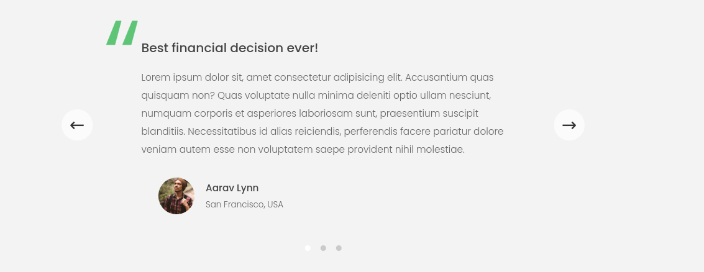

# Learnings

## Selecting, creating and deleting DOM elements

### Selecting DOM elements

```javascript
// Root node of the document
console.log(document.documentElement)

// Returns head element
console.log(document.head)

// Returns the body element
console.log(document.body)

// Selects the .header elemen
const header = document.querySelector('.header')

// Selects all .section elements
const allSections = document.querySelectorAll('section')
console.log(allSections)

// Get element with id
console.log(document.getElementById('section--1'))

// Select all elements with tagname button
const allButtons = document.getElementsByTagName('button')
console.log(allButtons)

// Select all elements with a certain classname
console.log(document.getElementsByClassName('btn'))
```

### Create elements

Create a HTML elements,

```javascript
const message = document.createElement('div')
```

Add a class to the elements,

```javascript
message.classList.add('cookie-message')
```

Add some content to element. You can both insert text or HTML,

```javascript
// Add text
message.textContent =
    'We used coockies for improved functionality and analytics'
```

```javascript
// Add HTML
message.innerHTML =
    'We use coockies for improved functionality and analytics. <button class ="btn btn--close-cookie">Got it! </button>'
```

#### Add created element to HTML

Once you have created the HTML element, you can add it to the HTML by either using `append()` or `prepend()`

```javascript
const header = document.querySelector('.header')
header.append(message)
```

```javascript
const header = document.querySelector('.header')
header.prepend(message)
```

Note that you can not insert the element several number of times since there
only need to exist one. What you can do its then to copy it if you want to
insert it at many different places in the HTML.

```javascript
const header = document.querySelector('.header')
header.append(message.cloneNode())
```

You can also add the element before or after an element as a sibling,

```javascript
const header = document.querySelector('.header')
header.before(message)
header.after(message.cloneNode())
```

### Remove elements

```javascript
document.querySelector('.btn--close-cookie').addEventListener('click', () => {
    message.remove()
})
```

You can also use something like,

```javascript
message.parentElement.removeChild(message)
```

## Styles, attributes and classes

### Styles

#### Set styles of elements

You can style elements with,

```javascript
const message = document.querySelector('.message')
message.style.backgroundColor = '#37383d'
message.style.width = '120%'
```

#### Get styles of elements

For inline elements, you can use

```javascript
console.log(message.style.width)
```

For non-inline styling, you can use `getComputedStyle`

```javascript
console.log(getComputedStyle(message).color)
console.log(getComputedStyle(message).height)
```

You can also use `getComputedStyle()` to set / increase current styling,

```javascript
// Note that you need to use Number.ParseFloat()
message.style.height =
    Number.parseFloat(getComputedStyle(message).height, 10) + 40 + 'px'
```

For root element styling i.e.,

```css
:root {
    --color-primary: #5ec576;
    --color-secondary: #ffcb03;
    --color-tertiary: #ff585f;
    --color-primary-darker: #4bbb7d;
    --color-secondary-darker: #ffbb00;
    --color-tertiary-darker: #fd424b;
    --color-primary-opacity: #5ec5763a;
    --color-secondary-opacity: #ffcd0331;
    --color-tertiary-opacity: #ff58602d;
    --gradient-primary: linear-gradient(to top left, #39b385, #9be15d);
    --gradient-secondary: linear-gradient(to top left, #ffb003, #ffcb03);
}
```

You can use `setProperty()` i.e.

```javascript
document.documentElement.style.setProperty('--color-primary', 'orangered')
```

### Attributes

#### Get attributes

For standard attributes,

```javascript
const logo = document.querySelector('.nav__logo')
console.log(logo.alt)
console.log(logo.src)
console.log(logo.className)
```

Note the different output of following,

```javascript
console.log(logo.src) // <http://127.0.0.1:8080/img/logo.png>
console.log(logo.getAttribute('src')) // img/logo.png

const link = document.querySelector('.twitter-link')
console.log(link.href) // Absolute URL
console.log(link.getAttribute('href')) // Relative URL
```

For non-standard attributes,

```javascript
console.log(logo.getAttribute('designer'))
console.log(logo.getAttribute('company'))
// console.log(logo.designer) // Doesnt work
```

#### Set attributes

For standard attributes,

```javascript
logo.alt = 'Beautiful minimalist logo'
```

For non-standard attributes,

```javascript
logo.setAttribute('company', 'Bankist')
```

#### Special attributes like `data`

Common to work with datasets when you need to store data in the HTML / UI. Use
non-camel-case in HTML and camel case in JavaScript.

```html

```

In JavaScript,

```javascript
console.log(logo.dataset.versionNumber)
```

### Classes

```javascript
// Use following methods to set classes to elements
logo.classList.add('c')
logo.classList.toggle('c')
logo.classList.contains('c')
logo.classList.remove('c')

// DO NOT USE FOLLOWING NOTATION - IT WILL OVERRIDE EVERYTHING
logo.className = 'Jonas'
```

## Smooth scrolling

Choose button that should initiate the scroll and the location where you
should scroll to.

```javascript
// Button that initates scrolling
const btnScrollTo = document.querySelector('.btn--scroll-to')
// Destination to scroll to
const section1 = document.querySelector('#section--1')
```

Add event listener to button and use function `scrollIntoView()`

```javascript
btnScrollTo.addEventListener('click', (el) => {
    section1.scrollIntoView({ behavior: 'smooth' })
})
```

There are optional ways of doing this as well,

```javascript
btnScrollTo.addEventListener('click', (e) => {
    const s1coords = section1.getBoundingClientRect()
    window.scrollTo({
        left: s1coords.left + window.pageXOffset,
        top: s1coords.top + window.pageYOffset,
        behaviour: 'smooth',
    })
})
```

Some descriptions of functions used in lecture,

`section1.getBoundingClientRect()`:

The returned value is a `DOMRect` object which is the smallest rectangle which
contains the entire element, including its padding and border-width. The left,
top, right, bottom, x, y, width, and height properties describe the position
and size of the overall rectangle in pixels. Properties other than width and
height are relative to the top-left of the viewport.

```javascript
btnScrollTo.addEventListener('click', (el) => {
    console.log(el.target.getBoundingClientRect())
})
```

`el` is the current element i.e. `btnScrollTo`

```javascript
console.log('Current scroll (X/Y)', window.pageXOffset, window.pageYOffset)
console.log(
    'Height / Width of viewport',
    document.documentElement.clientHeight,
    document.documentElement.clientWidth
)
```

`window.pageXOffset` and `window.pageYOffset`:

The `pageXOffset`, `pageYOffset` property returns the pixels a document has
scrolled from the upper left corner of the window.

`document.documentElement.clientWidth`, `document.documentElement.clientHeight`:
The `clientWidth` property returns the viewable width of an element in pixels,
including padding, but not the border, scrollbar or margin i.e. dimensions of
the viewport

## Types of events and event handlers

### Add an event listener

```javascript
const h1 = document.querySelector('h1')
const alertH1 = alert('Addeventlistener: Great! You are reading the heading')
h1.addEventListener('mouseover', alertH1)
```

You can also add it by specifying a callback,

```javascript
const h1 = document.querySelector('h1')
h1.addEventListener('mouseover', () => {
    alert('Addeventlistener: Great! You are reading the heading')
})
```

### Remove an event listener

```javascript
h1.removeEventListener('mouseenter', alertH1)
```

Remove event listener after a time period,

```javascript
const h1 = document.querySelector('h1')
const alertH1 = alert('Addeventlistener: Great! You are reading the heading')
h1.addEventListener('mouseover', alertH1)
setTimeout(() => h1.removeEventListener('mouseenter', alertH1), 3000)
```

### Add an event listener that only fires once

```javascript
const oneFunc = function () {
    alert('This will only come up once')
}

// Method that fires eventlistener only once
h1.addEventListener('mouseover', (el) => {
    oneFunc()
    h1.removeEventListener('mouseenter', oneFunc)
})
```

## Event propagation: Bubbling and Capturing

Events, in JavaScript, are occurrences that can trigger certain functionality,
and can result in certain behaviour. A common example of an event, is a
“click”, or a “hover”. You can set listeners to watch for these events that
will trigger your desired functionality.

Propagation refers to how events travel through the Document Object Model (DOM)
tree. The DOM tree is the structure which contains parent/child/sibling
elements in relation to each other. You can think of propagation as electricity
running through a wire, until it reaches its destination. The event needs to
pass through every node on the DOM until it reaches the end, or if it is
forcibly stopped.

Bubbling and Capturing are the two phases of propagation. In their simplest
definitions, bubbling travels from the target to the root, and capturing
travels from the root to the target. However, that doesn’t make much sense
without first defining what a target and a root is.

The target is the DOM node on which you click, or trigger with any other event.

For example, a button with a click event would be the event target.

The root is the highest-level parent of the target. This is usually the
document, which is a parent of the , which is a (possibly distant) parent of
your target element.

Capturing is not used nearly as commonly as bubbling, so our examples will
revolve around the bubbling phase. As an option though,
`EventTarget.addEventListener()` has an optional third parameter - which takes
its argument as a boolean - which controls the phase of the propagation. The
parameter is called `useCapture`, and passing true will cause the listener to be
on the capturing phase. The default is false, which will apply it to the
bubbling phase.

Once you trigger the event, it will propagate up to the root, and it will
trigger every single event handler which is associated with the same type. For
example, if your button has a click event, during the bubbling phase, it will
bubble up to the root, and trigger every click event along the way.

This kind of behaviour might not sound desirable - and it often isn’t - but
there’s an easy workaround...

These two methods are used for solving the previously mentioned problem
regarding event propagation. Calling `Event.stopPropagation()` will prevent
further propagation through the DOM tree, and only run the event handler from
which it was called.

```javascript
// Element not only answering to events originated at the element level, they
// also listen to elements that keeps bubbling up from child levels

const randomInt = (min, max) =>
    Math.floor(Math.random() * (max - min + 1) + min)

const randomColor = () =>
    `rgb(${randomInt(0, 255)}, ${randomInt(0, 255)}, ${randomInt(0, 255)})`
```

```javascript
// Note that el will be the same element in every function

// this not working with arrow function, need to use normal function
document.querySelector('.nav__link').addEventListener('click', function (el) {
    // this refers to selected element
    this.style.backgroundColor = randomColor()
    console.log('LINK', el.target, el.currentTarget)
    console.log(el.currentTarget === this)

    // Stop propagation
    el.stopPropagation()
})

// .nav__links is parent to .nav__link
document.querySelector('.nav__links').addEventListener('click', function (el) {
    this.style.backgroundColor = randomColor()
    console.log('CONTAINER', el.target, el.currentTarget)
    console.log(el.currentTarget === this)

    // Stop propagation
    el.stopPropagation()
})
// .nav is parent to .nav__links
document.querySelector('.nav').addEventListener('click', function (el) {
    this.style.backgroundColor = randomColor()
    console.log('NAV', el.target, el.currentTarget)
    console.log(el.currentTarget === this)

    // Stop propagation
    el.stopPropagation()
})
```

```javascript
//element not only answering to events originated at the element level, they
//also listen to elements that keeps bubbling up from child levels
const randomInt = (min, max) =>
    Math.floor(Math.random() * (max - min + 1) + min)

const randomColor = () =>
    `rgb(${randomInt(0, 255)}, ${randomInt(0, 255)}, ${randomInt(0, 255)})`

console.log(randomColor())

// this not really working with arrow function, need to use normal function
document.querySelector('.nav__link').addEventListener('click', function (el) {
    // this refers to selected element
    this.style.backgroundColor = randomColor()
    console.log('LINK', el.target, el.currentTarget)
    console.log(el.currentTarget === this)

    // Stop propagation
    el.stopPropagation()
})

// .nav__links is parent to .nav__link
document.querySelector('.nav__links').addEventListener('click', function (el) {
    this.style.backgroundColor = randomColor()
    console.log('CONTAINER', el.target, el.currentTarget)
    console.log(el.currentTarget === this)
    el.stopPropagation()
})
// .nav is parent to .nav__links
document.querySelector('.nav').addEventListener('click', function (el) {
    this.style.backgroundColor = randomColor()
    console.log('NAV', el.target, el.currentTarget)
    console.log(el.currentTarget === this)
    el.stopPropagation()
})

// el will be the same element
```

## Event delegation: Implementing page navigation

The main goal with this chapter is to implement smooth scrolling when clicking
on the links in the page navigation bar.

Since the `href` in the `a` tag is referring to section anchor i.e.
`href="#section--x` it will redirect you to that section when you click o the
link. To prevent that from happening, you need to use
`element.preventDefault()` when adding a event handler to these elements in the `js` code.

```html
<ul class="nav__links">
    <li class="nav__item">
        <a class="nav__link" href="#section--1">Features</a>
    </li>
    <li class="nav__item">
        <a class="nav__link" href="#section--2">Operations</a>
    </li>
    <li class="nav__item">
        <a class="nav__link" href="#section--3">Testimonials</a>
    </li>
    <li class="nav__item">
        <a class="nav__link nav__link--btn btn--show-modal" href="#"
            >Open account</a
        >
    </li>
</ul>
```

```javascript
// Select all elements with class nav__link
document.querySelectorAll('.nav__link').forEach(function (element) {
    // Add an event handler to all selected elements
    element.addEventListener('click', function (event) {
        // Prevent the app from using href="#section--x" in the HTML code
        event.preventDefault()
        // Get the attribute of href i.e. #section--x
        const id = this.getAttribute('href')
        console.log(id)
        // Smooth scroll into the link
        document.querySelector(id).scrollIntoView({ behavior: 'smooth' })
    })
})
```

The method above is OK to use if there are only a few elements, but in case of
there is many elements to select. Following code will run slow. Then its better
to use something called event delegation.

The idea is to select and add the event listener to the parent element
enclosing the elements for where you added the event listener in the first
place in the example above. Because of event propagation, you can now use a
matching strategy to apply the smooth scrolling to the correct section. You can
do this by using the fact that `event.target` specifies the element where the
user clicked among the child elements.

```javascript
document
    .querySelector('.nav__links')
    .addEventListener('click', function (event) {
        event.preventDefault()

        // Matching strategy
        // event.target is element among the child elements where the user clicked.
        if (event.target.classList.contains('nav__link')) {
            const id = event.target.getAttribute('href')
            console.log(id)
            document.querySelector(id).scrollIntoView({ behavior: 'smooth' })
        }
    })
```

## DOM Traversing

Some good reads about DOM Traversal

<https://zellwk.com/blog/dom-traversals/>

<https://www.digitalocean.com/community/tutorials/how-to-traverse-the-dom>

Select a element in the HTML document,

```javascript
const h1 = document.querySelector('h1')
```

### Downward traversal

Now traverse downwards. Select all children that belong to class `highlight`,

```javascript
// Select all elements that has class 'highlight' inside the h1 element/tag
console.log(h1.querySelectorAll('.highlight'))
```

Display all child nodes of the selected `h1` element,

```javascript
// Displays all child nodes e.g. text, comments, etc. (A lot of info)
console.log(h1.childNodes)
```

Display all the child HTML elements of `h1`,

```javascript
// Displays only all the HTML child elements
console.log(h1.children)
```

First child element of `h1` is,

```javascript
// First child HTML element inside h1
console.log(h1.firstElementChild)
```

Change styling,

```javascript
// Has inline CSS styling i.e. style="color: X"
h1.firstElementChild.style.color = 'white'
```

Last child element inside `h1`

```javascript
// Last child HTML element inside h1
console.log(h1.lastElementChild)
```

Change styling of last child element,

```javascript
// Has inline CSS styling i.e. style="color: X"
h1.lastElementChild.style.color = 'orangered'
```

### Upward traversal

```javascript
// Gets the parentNode
console.log(h1.parentNode)

// Gets the parent element
console.log(h1.parentElement)

// Gets the closest parent with class 'header'
h1.closest('.header').style.background = 'var(--gradient-secondary)'

// Gets the closest parent with class 'header'
h1.closest('.h1').style.background = 'var(--gradient-primary)'
```

### Sideways traversal

```javascript
// Previous element on the same level i.e. no parent and no child
console.log(h1.previousElementSibling)

// Next element on the same level i.e. no parent and no child
console.log(h1.nextElementSibling)

// Nodes?
console.log(h1.previousSibling)
console.log(h1.nextSibling)

// All siblings - Even the h1 element itself
console.log(h1.parentElement.children)

// All the siblings to h1
const temp = [...h1.parentElement.children]

// Scale all items with 0.5x exept
temp.forEach(function (el) {
    if (el !== h1) {
        el.style.transform = 'scale(0.5)'
    }
})
```

## Building a tabbed component


The active tab and content area belong to the classes `operations__tab--active`
and `operations__content--active`.

Following components belong to the whole tabbed component app,

```javascript
// Tabbed component
const tabs = document.querySelectorAll('.operations__tab')
const tabsContainer = document.querySelector('.operations__tab-container')
const tabContent = document.querySelectorAll('.operations__content')
```

To build efficient apps, we use event delegation instead of selecting the
actual element. With event delegation, we select the container element
enclosing the tabs

```javascript
// Event delegation -- choose parent instead of actual element
tabsContainer.addEventListener('click', function (event) {...})
```

To get the button element that was clicked we could use `event.target` and
succeed in the most cases but if you click on the span element inside the
button then you would instead get that specific span element. This only in
cases where the `button` tag is structured in the following way,

```html
<button class="..."><span>01</span></button>
```

To avoid this problem, you can use the `closest()` function.

```javascript
const clicked = event.target.closest('.operations__tab')
```

Since the event listener is now placed on the whole parent container. If the
user clicks on an element in the container that doest have a `classList`
attribute, an error will be raised. One way to handle this issue is to place
out a guard statement. See example below.

```javascript
if (!clicked) return
```

The tab has a certain functionality that when clicked, it somehow pops up
couple of pixels in an animated way i.e.,

```css
.operations__tab--active {
    transform: translateY(-66%);
}
```

In order to not get more than one tab popping, you will need to first remove
the `operations__tab--active` from all tab class lists. Then you just add it
back to the element that was clicked.

```javascript
tabs.forEach((element) => element.classList.remove('operations__tab--active'))
clicked.classList.add('operations__tab--active')
```

The same method yields with the content area for each tab i.e. `operations__content--active`

```javascript
tabContent.forEach((el) => el.classList.remove('operations__content--active'))
```

Note that every button has a data class i.e.,

```html
<button class="btn operations__tab operations__tab--2" data-tab="2">
    <span>02</span>Instant Loans
</button>
```

and every `operation__content` class item has also following class item
`operations__content--X` i.e.

```html
<div
    class="operations__content operations__content--1 operations__content--active"
>
    <div class="operations__icon operations__icon--1">
        <svg>
            <use xlink:href="img/icons.svg#icon-upload"></use>
        </svg>
    </div>
    <h5 class="operations__header">
        Tranfser money to anyone, instantly! No fees, no BS.
    </h5>
    <p>
        Lorem ipsum dolor sit amet, consectetur adipisicing elit, sed do eiusmod
        tempor incididunt ut labore et dolore magna aliqua. Ut enim ad minim
        veniam, quis nostrud exercitation ullamco laboris nisi ut aliquip ex ea
        commodo consequat.
    </p>
</div>
```

Using this, you can first select related `operations__content-X` class item by
using `${clicked.dataset.tab}` and add `operations__content--active` to its
class-list.

```javascript
console.log(clicked.dataset.tab)
document
    .querySelector(`.operations__content--${clicked.dataset.tab}`)
    .classList.add('operations__content--active')
```

## Passing arguments to event handlers

In this chapter, a menu fade animation is made. See image below,


This means, as soon as you enter with the mouse on one of the links, the other
links fade away. And once you move the mouse outside the link, the other links
un-fade.

First, we use event delegation and choose the parent container that encloses
the links and add an event listeners to them. One event listener for `mouseover`
and one for `mouseout`. With using bind, we can pass an argument to the
`handleHover` function.

```javascript
const nav = document.querySelector('.nav')
// Passing "argument" into handler
nav.addEventListener('mouseover', handleHover.bind(0.5))
nav.addEventListener('mouseout', handleHover.bind(1.0))
```

We could call the function `handleHover` from the callback function immediately
but that code is not really best practise i.e.,

```javascript
nav.addEventListener('mouseover', function (el) {
    handleHover(el, 0.5)
})

nav.addEventListener('mouseout', function (el) {
    handleHover(el, 1.0)
})
```

Then we implement the function `handleHover`

```javascript
const handleHover = function (el) {
    // Using Event Delegation - due to bubbling, same event listener event will
    // be triggered for all elements inside the parent nav container.
    // We need to select the one we are interest of i.e. the element that
    // belongs to the class nav__link
    if (el.target.classList.contains('nav__link')) {
        const link = el.target

        // Select all the siblings - i.e. all elements that belong to classList nav__link
        const siblings = link.closest('.nav').querySelectorAll('.nav__link')
        // Select the logo
        const logo = link.closest('.nav').querySelector('img')
        siblings.forEach((el) => {
            // Set the opacity level for all links except the one that was clicked
            if (el !== link) el.style.opacity = this
        })
        // Same with logo
        logo.style.opacity = this
    }
}
```

## Implementing a sticky navigation - The scroll event

```javascript
// Get the section 1 container
const section_1 = document.querySelector('#section--1')

// Get the coordinates for the container
const initialCoords = section_1.getBoundingClientRect()

// Add a scroll eventlistener to the window element
window.addEventListener('scroll', function (el) {
    // Y coordinate for current window
    console.log(window.scrollY)

    // If Y coordinate of window is larger than section--1 container top coordinates
    //  Then add the nav element to the classlist 'sticky'
    if (this.window.scrollY > initialCoords.top) {
        nav.classList.add('sticky')

        // Otherwise, remove nav from the classlist 'sticky'
    } else {
        nav.classList.remove('sticky')
    }
})
```

Adding a scroll event listener to the window element is memory and performance
consuming. There is a smarter way.

## A better way: The intersection observer API

A better and more efficient way is to create a `IntersectionObserver` object.
This object takes a callback function and some options as input.

The callback function will be triggered when the `root` element and the section
that is observed intersects with each other according to the `threshold`
variable in `obsOption`

```javascript
// This function will be trigerred once every threshold intersection is fulfilled
const obsCallback = function (entries, observer) {
    // Entries are an array of the threshold entries
    entries.forEach((entry) => {
        console.log(entry)
    })
    // This prints the obsOption project
    console.log(observer)
}

const obsOption = {
    // root: null means that the root element is the viewport
    root: null,

    // Callback function will be called everytime when the root element
    // (viewport) is intersecting the section1 with 0%, 25%, 75% and 100%.
    // Please note that section1 is much larger than viewport so the event 100%
    // will never happen.
    threshold: [0, 0.25, 0.5, 0.75, 1],
}

const observer = new IntersectionObserver(obsCallback, obsOption)
section1 = document.querySelector('.section--1')

// The element section1 is being observed
observer.observe(section1)
```

Now, lets look how to solve our main problem to only show the header when there
is 0% overlap with the `viewport` and the `header`.

```javascript
// The header container / area
const header = document.querySelector('.header')
// The height of the nav container
const navHeight = nav.getBoundingClientRect().height

// Callback function that will be triggered when criteria in options are
// fulfilled
const obsCallback = function (entries, observer) {
    // same as const entry = entries[0]
    const [entry] = entries
    // When there is no intersection add nav to the classlist 'sticky'
    if (!entry.isIntersecting) {
        nav.classList.add('sticky')
    } else {
        // Otherwise, when there is an intersection between viewport and
        // header, remove nav from the classlist 'sticky'
        nav.classList.remove('sticky')
    }
}

const obsOption = {
    root: null,
    // threshold 0: when you exit the area with viewport
    threshold: 0,
    // How many pixels before will you let the callback function be trigerred
    rootMargin: `-${navHeight}px`,
}

const observer = new IntersectionObserver(obsCallback, obsOption)
observer.observe(header)
```

## Revealing elements on scroll

```javascript
// Select all section containers
const allSections = document.querySelectorAll('.section')

// Build the callback function
const revealSection = function (entries, observer) {
    //Only one threshold - same as const entry = entries[0]
    const [entry] = entries
    // Do nothing if there is no intersection
    if (!entry.isIntersecting) return
    // If there is intersection, remove the interescted element from the
    // classList 'section--hidden'
    // Note that you can get the intersected element by entry.target
    else entry.target.classList.remove('section--hidden')

    // Unobserve
    observer.unobserve(entry.target)
}

const sectionObserver = new IntersectionObserver(revealSection, {
    // Check for intersections with viewport
    root: null,
    // Intersected threshold 15%
    threshold: 0.15,
})

// Observe all sections
// Add each section element to the classlist 'section--hidden'
allSections.forEach(function (el) {
    sectionObserver.observe(el)
    el.classList.add('section--hidden')
})
```

## Lazy loading of images

To improve performance, its necessary to do lazy loading of images. This means
that images are loaded when only necessary.

The images of interest have following html tag and CSS attributes,

```html

```

```css
.features__img {
    width: 100%;
}

.lazy-img {
    filter: blur(20px);
}
```

The image that ends with `...-lazy.jpg` is a very small image compared to the
one in the `data.src` attribute.

We want to load the small image first and then lazy-load the large images. See
code below to achieve this,

```javascript
// Select all images thas has a data-src attribute
const imgTargets = document.querySelectorAll('img[data-src]')

const loadImg = function (entries, observer) {
    // Only one element in threshold
    const [entry] = entries

    // Do nothing if there is no intersection
    if (!entry.isIntersecting) return
    // At intersection set the image source (entry.target.src) to the source in
    // the attribute `data-src`. Please note that in `JavaScript` we refer to
    // that attribute as dataset.src
    entry.target.src = entry.target.dataset.src

    // When large image has fully loaded, then get rid of the blur i.e. remove
    // entry.target from // the classlist 'lazy-img'.
    entry.target.addEventListener('load', function () {
        entry.target.classList.remove('lazy-img')
    })

    // Unobserve images when fully loaded
    observer.unobserve(entry.target)
}

const imgObserver = new IntersectionObserver(loadImg, {
    root: null,
    threshold: 0,
    // Create some margin
    rootMargin: '200px',
})

// Observe all imgTarget elements
imgTargets.forEach((img) => imgObserver.observe(img))
```

## Slider component

A slider component looks like following,



There are several things to think about when constructing this kind of component,

```javascript
// All slides inside the slide container
const slides = document.querySelectorAll('.slide')
// Button on left side of slider
const btnLeft = document.querySelector('.slider__btn--left')
// Button on right slide of slider
const btnRight = document.querySelector('.slider__btn--right')
// Container that contains all the dots that exists on all slide images
const dotContainer = document.querySelector('.dots')

// Functions create all the dots
const createDots = function () {
    // Loop through all the slides - We are just interested in the length
    // There will be same amount of dots as there exists slides
    slides.forEach(function (_, i) {
        // Insert following code into the end of the dotContainer
        // Same amount of times as the number of slides that exists
        dotContainer.insertAdjacentHTML(
            'beforeend',
            `<button class="dots__dot" data-slide="${i}"></button>`
        )
    })
}

// Mark the current active slide as 'active'
const activateDot = function (slide) {
    // Get all dot elements
    const dots = document.querySelectorAll('.dots__dot')
    // First remove each element for the classList 'dots__dot--active'
    dots.forEach(function (el) {
        el.classList.remove('dots__dot--active')
    })

    // Select an element that beloings to the classList 'dots__dot' which
    // also has an attribute data-slide=x. Then add it to the 'dots__dot--active'
    // classlist
    document
        .querySelector(`.dots__dot[data-slide="${slide}"]`)
        .classList.add('dots__dot--active')
}

// Function that handles the order of slides through the 'translateX' function
const gotoSlide = function (slide) {
    /*
    If slide nr 0 is the active slide, then the slides will have following placement in order,
    [0, 100, 200, 300, 400]

    if slide nr 1 is active, then,
      [-100, 0, 100, 200, 300]

    If slide nr 3 is active then,
    [-300, -200, -100, 0, 100]
    */
    slides.forEach((s, i) => {
        s.style.transform = `translateX(${100 * (i - slide)}%)`
    })

    // Activate the slide
    activateDot(slide)
}

// Function that activates next slide
const nextSlide = function () {
    // If the current slide value is equal to the max nr of slides, then set
    // the slide value to 0
    if (curSlide === maxSlide) curSlide = 0
    // Otherwise, you can allow it to increase in value
    else curSlide++

    gotoSlide(curSlide)
}
// Function that activates previous slide
const prevSlide = function () {
    // If current slide is equal to  0, then set the slide value to maxslide
    if (curSlide === 0) curSlide = maxSlide
    // Else, let the slide value decrease by 1
    else curSlide--

    gotoSlide(curSlide)
}

// Variables
//
// Number of the current selected slide
let curSlide = 0
// Number of slides
const maxSlide = slides.length - 1

// Create the dots graphically in the slider
createDots()
gotoSlide(0)

// Add event listeners
btnRight.addEventListener('click', nextSlide)
btnLeft.addEventListener('click', prevSlide)

document.addEventListener('keydown', function (e) {
    if (e.key === 'ArrowLeft') prevSlide()

    e.key === 'ArrowRight' && nextSlide()
})

// Add eventlistener to dot container
dotContainer.addEventListener('click', function (e) {
    if (e.target.classList.contains('dots__dot')) {
        // const slide = e.target.dataset.slide same as below with destructuring
        const { slide } = e.target.dataset
        gotoSlide(slide)
    }
})
```

## Lifecycle DOM events

```javascript
// This eventhandler will be triggered when HTML is parsed and DOM tree has
// been built
//
// NOTE:.
// You dont need to add everything in this eventhandler.
// You can solve it by putting the script tag in the end of the html body.
// Or you can use defer and put the script tag in the head
document.addEventListener('DOMContentLoaded', function (e) {
    console.log('HTML parsed and DOM tree built.')
    console.log(e)
})

// This event handler wil be trigerred when the page is fully loaded.
// This includes images as well as css files
window.addEventListener('load', function (e) {
    console.log('Page fully loaded inc. images and css')
})

// This event listener is trigerred right after the user decides to leave the
// page / close the page
window.addEventListener('beforeunload', function (e) {
    e.preventDefault()
    console.log(e)
    e.returnValue = ''
})
```

## Efficient script loading - defer and async

To implement JavaScript code, use following tag in the header. Its important
that you add `defer`

```html
<script src="script.js" defer></script>
```
