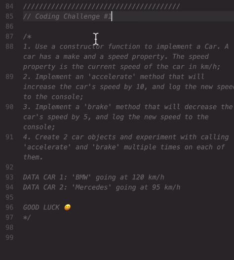
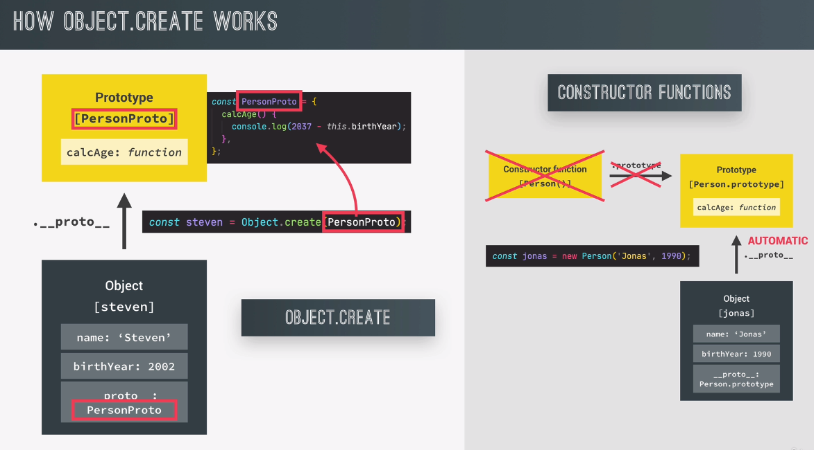
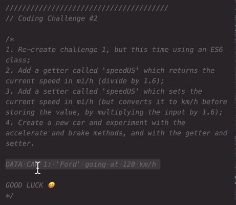
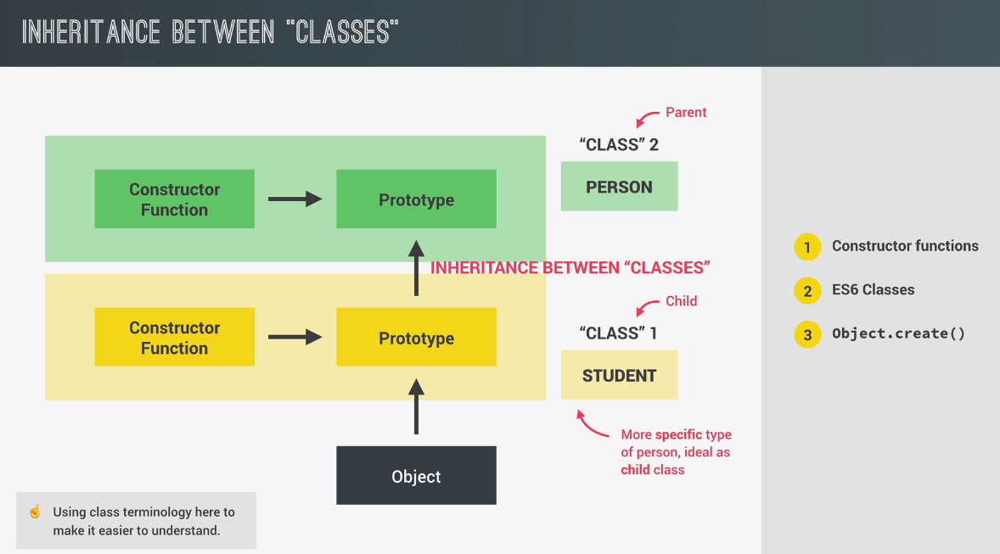
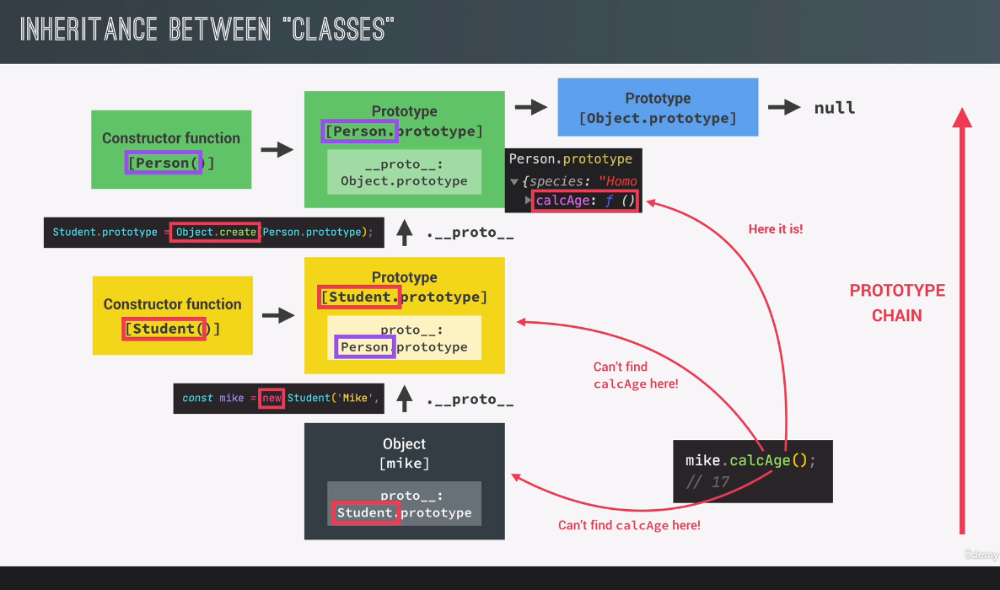
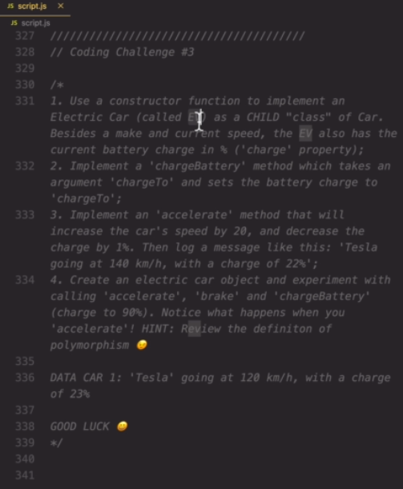

# OOP

## What is OOP

### Abstraction


### Encapsulation


### Inheritance


### Polymorphism


## OOP in Javascript


## Constructor functions and the new operator

```javascript
// Arrow function can not be used as a function contstructor since it doesnt
// have its own this keyword.
// Following is a constructor function.
const Person = function (firstName, birthYear) {}

new Person('Jonas', 1991)
```

Given the code above, following tasks are executed,

1. New `{}` is created
2. Function is called, now `this = {}`
3. `{}` is linked to prototype
4. Function automatically return `{}`

Now, see following code,

```javascript
const Person = function (firstName, birthYear) {
    this.firstName = firstName
    this.birthYear = birthYear
    // Never do this
    // Instead, use prototypal inheritance iunstead for efficiency.
    this.calcAge = function () {
        console.log(2037 - this.birthYear)
    }
}

// Instances
const jonas = new Person('Jonas', 1991)
const matilda = new Person('Matilda', 2017)
const jack = new Person('Jack', 2017)
console.log(matilda, jack)

console.log(jonas instanceof Person) // true
```

## Prototypes

Remember following code,

```javascript
const Person = function (firstName, birthYear) {
    this.firstName = firstName
    this.birthYear = birthYear
    }
}


const jonas = new Person('Jonas', 1991)
const matilda = new Person('Matilda', 2017)
const jack = new Person('Jack', 2017)
```

All instance of Person will inherit from `Person.prototype`. This means that
all instances of `Person` will have all the properties of the `prototype`
object. This is much more efficient code since its only the `prototype` object
that has the `calcAge` function and the `species` variable. Not all the
instances of `Person`

```javascript
Person.prototype.calcAge = function () {
    console.log(2037 - this.birthYear)
}
Person.prototype.species = 'Homo Sapiens'
console.log(jonas.species) // Homo Sapiens
jonas.calcAge() // 46
```

Some more examples to increase the understanding of prototypes,

```javascript
console.log(jonas.__proto__)
console.log(jonas.__proto__ === Person.prototype) // true
console.log(Person.prototype.isPrototypeOf(jonas)) // true
console.log(Person.prototype.isPrototypeOf(matilda)) // true
console.log(Person.prototype.isPrototypeOf(Person)) // false

console.log(jonas.hasOwnProperty('firstName')) // true
console.log(jonas.hasOwnProperty('species')) // false
```

## Prototype inheritance and the prototype chain


## Prototypal inheritance and built in objects

Prototypal inheritance is just a mechanism to reuse code.


```javascript
console.log(jonas.__proto__) // Person.prototype
console.log(jonas.__proto__.__proto__) // Object.prototype
console.log(jonas.__proto__.__proto__.__proto__) // null
console.dir(Person.prototype.constructor) // function(firstName, birthYear)

const arr = [3, 6, 4, 5, 6, 9, 3]
console.log(arr.__proto__)
console.log(arr.__proto__ == Array.prototype) // true
console.log(arr.__proto__.__proto__)

Array.prototype.unique = function () {
    return [...new Set(this)]
}

// Not recommended
console.log(arr.unique()) // [3,6,4,5,9]
```

## Coding challenge



```javascript
const Car = function (make, speed) {
    this.make = make
    this.speed = speed
}

Car.prototype.accelrate = function () {
    this.speed += 10
    console.log(`${this.make} speed is ${this.speed}`)
}

Car.prototype.break = function () {
    this.speed -= 10
    console.log(`${this.make} speed is ${this.speed}`)
}

const bmw = new Car('Bmw', 50)
bmw.accelrate()
bmw.break()

const volvo = new Car('Volvo', 70)
volvo.accelrate()
volvo.break()
```

## ES6 Classes

Following code,

```javascript
class PersonCl {
    constructor(firstName, birthYear) {
        this.firstName = firstName
        this.birthYear = birthYear
    }

    // These will end up at the prototype level
    calcAge() {
        console.log(2037 - this.birthYear)
    }
}
```

is exactly the same as following code,

```javascript
const PersonCl = function (firstName, birthYeart) {
    this.firstName = firstName
    this.birthYear = birthYear
}

PersonCl.prototype.calcAge = function () {
    console.log(2037 - this.birthYear)
}
```

Some info about classes,

1. Classes are NOT hoisted
2. Class are first-class citizens
3. Classes are executed in strict mode

```javascript
const jessica = new PersonCl('Jessica', 1996)
console.log(jessica.__proto__ === PersonCl.prototype) // true
```

## Setters and getters

```javascript
const account = {
    owner: 'jonas',
    movements: [200, 530, 120, 300],
    get latest() {
        return this.movements.slice(-1).pop()
    },

    set latest(mov) {
        this.movements.push(mov)
    },
}

console.log(account.latest) // 300
account.latest = 50
console.log(account.movements) // [200, 530, 120, 300, 50]
```

Getters and setters are good functionalities that you can use for data validation

```javascript
class AnotherPerson {
    constructor(fullName, birthYear) {
        this.fullName = fullName
        this.birthYear = birthYear
    }

    get age() {
        return 2037 - this.birthYear
    }

    // Setters are good for data validation
    set fullName(name) {
        if (name.includes(' ')) this._fullName = name
        else alert(`${name} is not a full name`)
    }
    get fullName() {
        return this._fullName
    }
}

const jess = new AnotherPerson('Jessica Davis', 1996)
const anotherJess = new AnotherPerson('Jessica', 1996) // Alert!
```

## Static methods

Static methods are attached to the constructor and not the prototype property
of the constructor. Therefor, no instances of classes that has static methods
do not inherit these methods.

```javascript
class AnotherPerson {
    constructor(fullName, birthYear) {
        this.fullName = fullName
        this.birthYear = birthYear
    }

    get age() {
        return 2037 - this.birthYear
    }

    set fullName(name) {
        if (name.includes(' ')) this._fullName = name
        else alert(`${name} is not a full name`)
    }
    get fullName() {
        return this._fullName
    }
    // One way to create static methods
    static helloThere() {
        console.log('Hello there!!!')
        console.log(this)
    }
}

const jess = new AnotherPerson('Jessica Davis', 1996)

// Another way to create static methods
AnotherPerson.hey = function () {
    console.log('Hey there')
    console.log(this) // class AnotherPerson {...}
}

AnotherPerson.hey() // Hey there
AnotherPerson.helloThere() // Hello there!!!
// jess.hey() Not working
// jess.helloThere() Not working
```

Other examples of static methods,

```javascript
Number.parseFloat(12)
Array.from(document.querySelectorAll('h1'))
```

## Object.create

You can also use `Object.create` to create instances of objects and link it to
a certain `prototype` attribute.



See example below,

```javascript
const PersonProto = {
    calcAge() {
        console.log(2037 - this.birthYear)
    },
    init(firstName, birthYear) {
        this.firstName = firstName
        this.birthYear = birthYear
    },
}

const steven = Object.create(PersonProto) // steven has calcAge in its Prototype
steven.name = 'Steven' // steven has name as an attribute
steven.birthYear = 2002 // steven has a birthYear as an attribute
steven.calcAge() // 58
console.log(steven) // {name: 'Steven', birthYear: 2002, Prototype: Object}
console.log(steven.__proto__)
// {calcAge: f calcAge(), init: f init(firstName, birthYear), Prototype: Object}

// You can also do following but using the init function in the PersonProto class
const sarah = Object.create(PersonProto)
sarah.init('Sarah', 1979)
sarah.calcAge()
```

## Coding challenge II



```javascript
class Car {
    constructor(make, speed) {
        this.make = make
        this.speed = speed
    }

    accelrate() {
        this.speed += 10
        console.log(`${this.make} is going at ${this.speed} Km/h`)
    }

    break() {
        this.speed -= 10
        console.log(`${this.make} is going at ${this.speed} Km/h`)
    }

    get speedUS() {
        return this.speed / 1.6
    }

    set speedUS(speed) {
        this.speed = speed * 1.6
    }
}

const volvo = new Car('Volvo', 100)

console.log(volvo.speedUS) // 62.5
volvo.speedUS = 80
volvo.accelrate() // Volvo is going at 138 Km/h
console.log(volvo.speedUS) 86.25
volvo.break() // Volvo is going at 128 Km / h
```

## Inheritance between classes: Constructor functions





```javascript
const Person = function (firstName, birthYear) {
    this.firstName = firstName
    this.birthYear = birthYear
}

Person.prototype.calcAge = function () {
    console.log(2037 - this.birthYear)
}

const Student = function (firstName, birthYear, course) {
    // Call the constructor but with the *this* pointer for the Student instance
    Person.call(this, firstName, birthYear)
    this.course = course
}
// Linking prototypes - Student prototype is linked to Person.prototype
// You can not do:
// Student.prototype = Person.prototype
// Thats not linking, thats basically saying they are the same which is not correct
Student.prototype = Object.create(Person.prototype)
// Object.setPrototypeOf(Student.prototype, Person.prototype)

Student.prototype.introduce = function () {
    console.log(`My name is ${this.firstName} and i study ${this.course}`)
}

const mike = new Student('Mike', 2020, 'Computer Science')
mike.introduce()
mike.calcAge() // 17
```

## Coding challenge III



```javascript
const Car = function (make, speed) {
    this.make = make
    this.speed = speed
}

const EV = function (make, speed, charge) {
    Car.call(this, make, speed)
    this.charge = charge
}

Car.prototype.brake = function () {
    this.speed += -10
    console.log(`${this.make} is braking, speed is now ${this.speed} Km/h`)
}

Car.prototype.status = function () {
    console.log(`${this.make} is going full speed ahead at ${this.speed} Km/h`)
}

Car.prototype.accelrate = function () {
    this.speed += 20
    console.log(`${this.make} is accelrating, going at ${this.speed} Km/h`)
}

EV.prototype = Object.create(Car.prototype)

const volvo = new Car('Volvo', 50)
const tesla = new EV('Tesla', 60, 100)
volvo.status() // Volvo is going full speed ahead at 50 Km/h
volvo.accelrate() // Volvo is accelrating, going at 70 Km/h
volvo.brake() // Volvo is braking, speed is now 60 Km/h

tesla.status() // Tesla is going full speed ahead at 60 Km/h
tesla.accelrate() // Tesla is accelrating, going at 80 Km/h
tesla.brake() // Tesla is braking, speed is now 70 Km/h

EV.prototype.status = function () {
    console.log(
        `${this.make} is going full speed ahead at ${this.speed} Km/h with charge ${this.charge}`
    )
}

EV.prototype.accelrate = function () {
    this.charge += -10
    console.log(
        `${this.make} is accelrating, going at ${this.speed} Km/h with charge ${this.charge}`
    )
}
tesla.status() // Tesla is going full speed ahead at 70 Km/h with charge 100
tesla.accelrate() //  Tesla is accelrating, going at 70 Km/h with charge 90
```

## Inheritance between "Classes": ES6 Classes

```javascript
class PersonCl {
    constructor(fullName, birthYear) {
        this.fullName = fullName
        this.birthYear = birthYear
    }
    calcAge() {
        console.log(2037 - this.birthYear)
    }

    get age() {
        return 2037 - this.birthYear
    }

    // Setters are good for data validation
    set fullName(name) {
        if (name.includes(' ')) this._fullName = name
        else alert(`${name} is not a full name`)
    }
    get fullName() {
        return this._fullName
    }
}
// StudentCl inherits from PersonCl
class StudentCl extends PersonCl {
    constructor(fullName, birthYear, course) {
        super(fullName, birthYear)
        this.course = course
    }

    introduce() {
        console.log(`My name is ${this.fullName} and i study ${this.course}`)
    }

    // Override calcAge function of parent
    calcAge() {
        console.log(
            `I am ${
                2037 - this.birthYear
            } years old, but as a student i feel more like ${
                2037 - this.birthYear + 10
            }`
        )
    }
}

const martha = new StudentCl('Martha Jonas', 2012, 'Computer science')
martha.introduce()
console.log(martha.age)
console.log(martha.fullName)
```

## Inheritance between classes: `Object.create`

```javascript
const PersonProto = {
    calcAge() {
        console.log(2037 - this.birthYear)
    },
    init(firstName, birthYear) {
        this.firstName = firstName
        this.birthYear = birthYear
    },
}

// const steven = Object.create(PersonProto)
const StudentProto = Object.create(PersonProto)
StudentProto.init = function (firstName, birthYear, course) {
    PersonProto.init.call(this, firstName, birthYear)
    this.course = course
}

StudentProto.introduce = function () {
    console.log(`My name is ${this.firstName} and i study ${this.course}`)
}

const jay = Object.create(StudentProto)
jay.init('Jay', 2010, 'Computer Science')
jay.introduce()
jay.calcAge()
```

## Another class example

Following is an example of an bank account class

```javascript
class Account {
    constructor(owner, currency, pin) {
        this.owner = owner
        this.currency = currency
        this.pin = pin
        this.movements = []
        this.locale = navigator.language

        console.log(`Thanks for opening an account, ${this.owner}`)
    }

    approveLoan(val) {
        return true
    }

    requestLoan(val) {
        if (this.approveLoan(val)) {
            this.deposit(val)
            console.log('Loan approved and deposited')
        } else {
            console.log('Loan not approved')
        }
    }

    // Public interface
    deposit(val) {
        this.movements.push(val)
    }

    withdraw(val) {
        this.deposit(-val)
    }
}

const acc1 = new Account('Jonas', 'EUR', 1111)

acc1.deposit(250)
acc1.withdraw(140)
acc1.requestLoan(1000)

/*
 * Following code should not be available to public, this is a probelm we need
 * to fix.
 */

acc1.approveLoan(1000)
console.log(acc1)
console.log(acc1.pin)
```

## Encapsulation: Protected properties and methods

One way you can protect elements inside your class is to name then by
`_variableName` but then this convention must be super clear with all team
members working on the project. Problem is that variables can still be accessed.

See example below,

```javascript
class Account {
    constructor(owner, currency, pin) {
        this.owner = owner
        this.currency = currency
        this._pin = pin
        this._movements = []
        this.locale = navigator.language

        console.log(`Thanks for opening an account, ${this.owner}`)
    }

    _approveLoan(val) {
        return true
    }

    getMovements() {
        return this._movements
    }

    requestLoan(val) {
        if (this._approveLoan(val)) {
            this.deposit(val)
            console.log('Loan approved and deposited')
        } else {
            console.log('Loan not approved')
        }
    }

    // Public interface
    deposit(val) {
        this._movements.push(val)
    }

    withdraw(val) {
        this.deposit(-val)
    }
}

const acc1 = new Account('Jonas', 'EUR', 1111)

acc1.deposit(250)
acc1.withdraw(140)
acc1.requestLoan(1000)
```

## Encapsulation: Private class fields and methods

Private fields and methods are set with `#` before the variable name. See
syntax below.

```javascript
class Account {
    // 1. Public fields (Instances) - Not added to prototypes - Just instances
    locale = navigator.language

    // 2. Private fields (Available only on the instances)
    #movements = []
    #pin

    constructor(owner, currency, pin) {
        this.owner = owner
        this.currency = currency
        this.#pin = pin

        console.log(`Thanks for opening an account, ${this.owner}`)
    }

    // 3. Public methods
    getMovements() {
        return this.#movements
    }

    requestLoan(val) {
        if (this.#approveLoan(val)) {
            this.deposit(val)
            console.log('Loan approved and deposited')
        } else {
            console.log('Loan not approved')
        }
    }
    deposit(val) {
        this.#movements.push(val)
    }

    withdraw(val) {
        this.deposit(-val)
    }

    // 4. Private methods
    #approveLoan(val) {
        return true
    }
}

const acc1 = new Account('Jonas', 'EUR', 1111)

acc1.deposit(250)
acc1.withdraw(140)
acc1.requestLoan(1000)

console.log(acc1)
```

## Chaining methods

This chapter illustrates how you ca do chaining as in the following example,

```javascript
acc1.deposit(300).deposit(500).withdraw(35).requestLoan(2500).withdraw(4000)
```

See implementation below,

```javascript
class Account {
    // 1. Public fields (Instances) - Not added to prototypes - Just instances
    locale = navigator.language

    // 2. Private fields (Available only on the instances)
    #movements = []
    #pin

    constructor(owner, currency, pin) {
        this.owner = owner
        this.currency = currency
        this.#pin = pin

        console.log(`Thanks for opening an account, ${this.owner}`)
    }

    // 3. Public methods

    getMovements() {
        return this.#movements
    }

    requestLoan(val) {
        if (this.#approveLoan(val)) {
            this.deposit(val)
            console.log('Loan approved and deposited')
        } else {
            console.log('Loan not approved')
        }
        // forchaining
        return this
    }
    deposit(val) {
        this.#movements.push(val)
        // for chaining
        return this
    }

    withdraw(val) {
        this.deposit(-val)
        // for chaining
        return this
    }

    // 4. Private methods
    #approveLoan(val) {
        return true
    }
}

const acc1 = new Account('Jonas', 'EUR', 1111)

// Chaining
acc1.deposit(300).deposit(500).withdraw(35).requestLoan(2500).withdraw(4000)
console.log(acc1.getMovements()) // [300, 500, -35, 2500, -4000]
```
