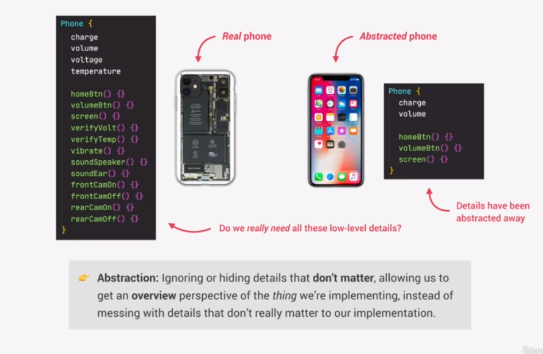
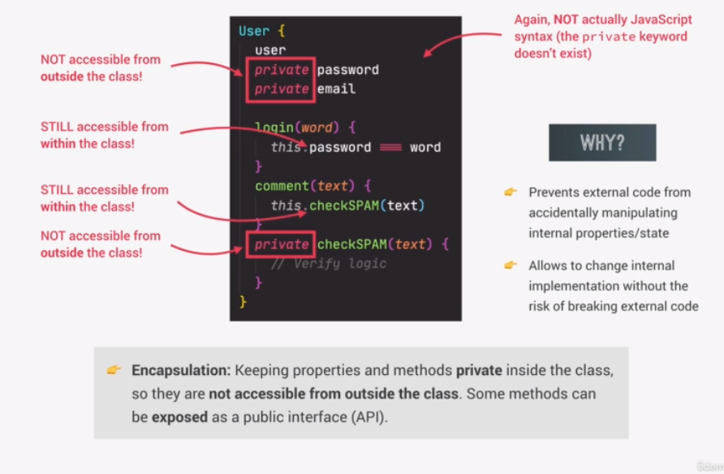
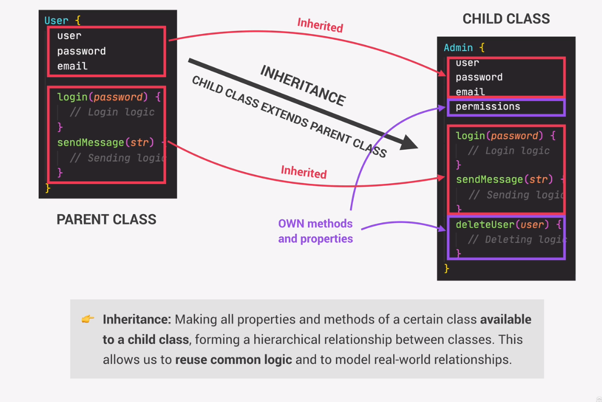
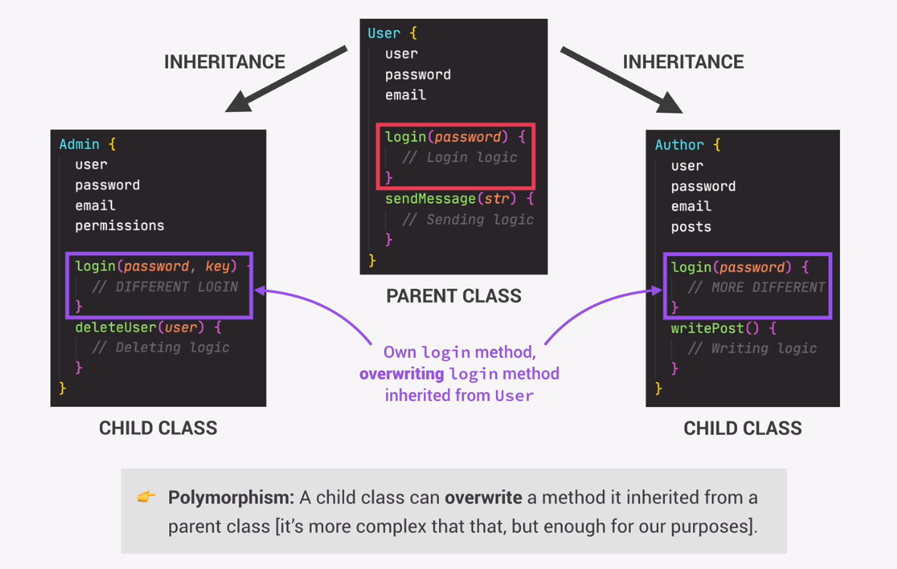
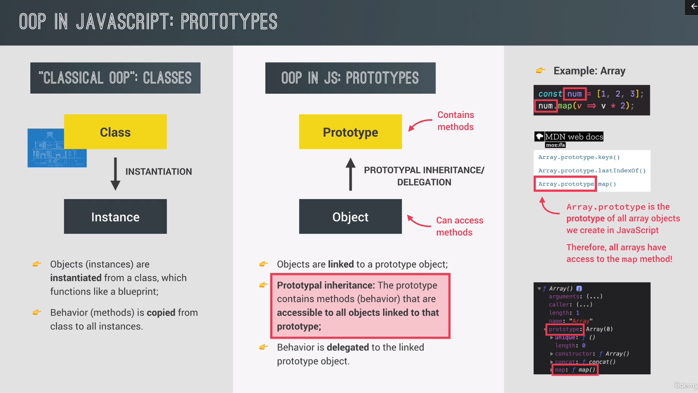
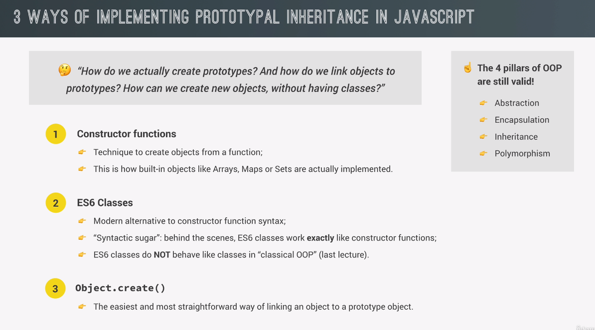
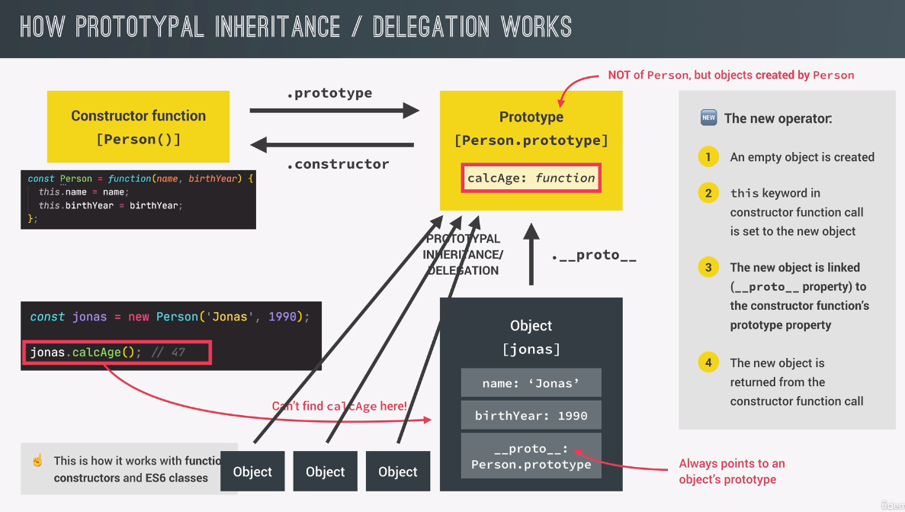
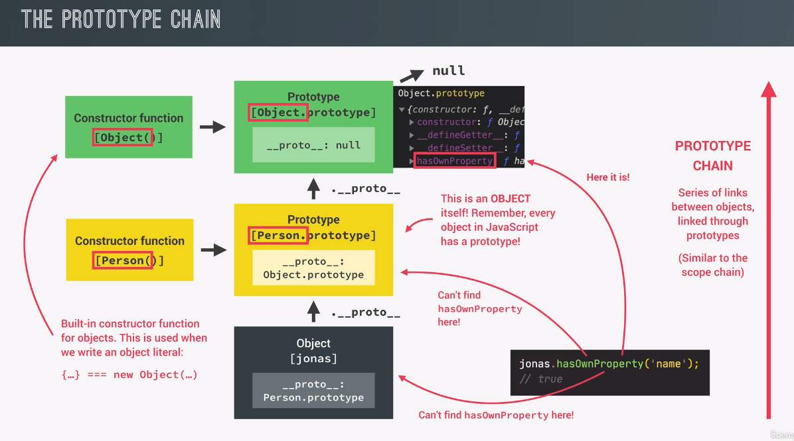
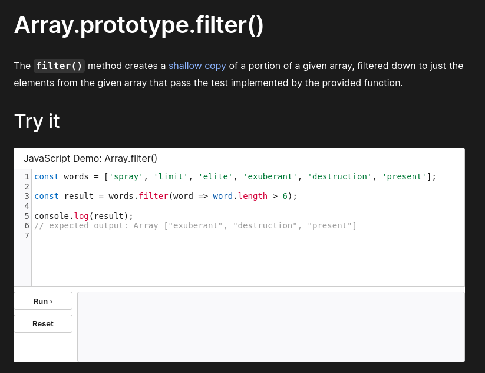

# OOP

## What is OOP

### Abstraction



### Encapsulation



### Inheritance



### Polymorphism



## OOP in Javascript





## Constructor functions and the new operator

```javascript
// Arrow function can not be used as a function contstructor since it doesnt
// have its own this keyword.
// Following is a constructor function.
const Person = function (firstName, birthYear) {}

new Person('Jonas', 1991)
```

Given the code above, following tasks are executed,

1. New `{}` is created
2. Function is called, now `this = {}`
3. `{}` is linked to prototype
4. Function automatically return `{}`

Now, see following code,

```javascript
const Person = function (firstName, birthYear) {
    this.firstName = firstName
    this.birthYear = birthYear
    // Never do this
    // Instead, use prototypal inheritance iunstead for efficiency.
    this.calcAge = function () {
        console.log(2037 - this.birthYear)
    }
}

// Instances
const jonas = new Person('Jonas', 1991)
const matilda = new Person('Matilda', 2017)
const jack = new Person('Jack', 2017)
console.log(matilda, jack)

console.log(jonas instanceof Person) // true
```

## Prototypes

Remember following code,

```javascript
const Person = function (firstName, birthYear) {
    this.firstName = firstName
    this.birthYear = birthYear
    }
}


const jonas = new Person('Jonas', 1991)
const matilda = new Person('Matilda', 2017)
const jack = new Person('Jack', 2017)
```

All instance of Person will inherit from `Person.prototype`. This means that
all instances of `Person` will have all the properties of the `prototype`
object. This is much more efficient code since its only the `prototype` object
that has the `calcAge` function and the `species` variable. Not all the
instances of `Person`

```javascript
Person.prototype.calcAge = function () {
    console.log(2037 - this.birthYear)
}
Person.prototype.species = 'Homo Sapiens'
console.log(jonas.species) // Homo Sapiens
jonas.calcAge() // 46
```

Some more examples to increase the understanding of prototypes,

```javascript
console.log(jonas.__proto__)
console.log(jonas.__proto__ === Person.prototype) // true
console.log(Person.prototype.isPrototypeOf(jonas)) // true
console.log(Person.prototype.isPrototypeOf(matilda)) // true
console.log(Person.prototype.isPrototypeOf(Person)) // false

console.log(jonas.hasOwnProperty('firstName')) // true
console.log(jonas.hasOwnProperty('species')) // false
```

## Prototype inheritance and the prototype chain





## Prototypal inheritance and built in objects

Prototypal inheritance is just a mechanism to reuse code.



```javascript
console.log(jonas.__proto__) // Person.prototype
console.log(jonas.__proto__.__proto__) // Object.prototype
console.log(jonas.__proto__.__proto__.__proto__) // null
console.dir(Person.prototype.constructor) // function(firstName, birthYear)

const arr = [3, 6, 4, 5, 6, 9, 3]
console.log(arr.__proto__)
console.log(arr.__proto__ == Array.prototype) // true
console.log(arr.__proto__.__proto__)

Array.prototype.unique = function () {
    return [...new Set(this)]
}

// Not recommended
console.log(arr.unique()) // [3,6,4,5,9]
```
