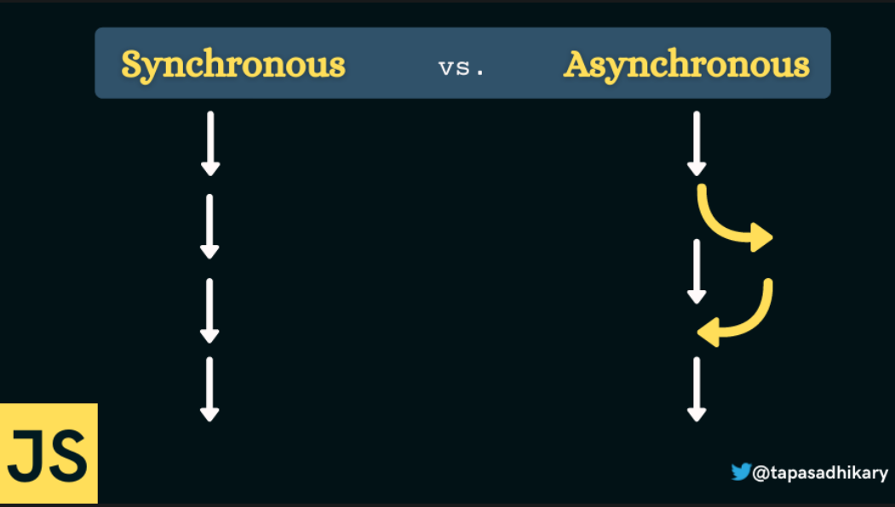

# Learnings

## Examples on synchronous (blocking code)

Please see following illustration that explains the difference between synchronous and asynchronous code,




Please also read following tutorial on the callstack etc:
[Call Stack on freecodecamp](https://www.freecodecamp.org/news/synchronous-vs-asynchronous-in-javascript/)

Following illustrates synchronous blocking code. The `alert()` function will block code execution.


```javascript
// This code will run immediately
console.log('Hello')
// Code blocking
alert('Alert')
// Will run after alert window is closed
console.log('This code will run when alert window has been closed)
```

## Examples on asynchronous code

Following is an example of asynchronous code with the function `setTimeout()`.

```javascript
// Code will run immediately
console.log('This code will run immediately')

// async function - will run after timer is finished
setTimeout(function() {
  console.log('This code will run after 5 seconds')
}, 5000)

// Will run after first console print
console.log('This code will run immediatelly after first console print)
```

Following illustrates an example of asynchronous code related to loading images. Please note that the callback itself is not asynchronous, its more the load event that is asynchronous.

```javascript
// Synchronous code
const img = document.querySelector('.dog')

// An event-listener that will run after the loading of the image is finished
img.addEventListener('load', function() {
  img.classList.add('fadeIn')
})

// Image is loading asynchronously in background
img.src = 'dog.jpg'

// Synchronous code
p.style.width = '300px
```

## Old school `Ajax` calls

Following is an example how `ajax` calls was done earlier.

```javascript
'use strict'
const btn = document.querySelector('.btn-country')
const countriesContainer = document.querySelector('.countries')

///////////////////////////////////////
// OLD SCHOOL WAY TO MAKE HTTP REQUESTS

function getCountryData(country) {
  const request = new XMLHttpRequest()
  request.open('GET', `https://restcountries.com/v2/name/${country}`)
  request.send()

  request.addEventListener('load', function () {
    const [data] = JSON.parse(this.responseText)
    console.log(data)

    const html = `
          <article class="country">
            
            <div class="country__data">
              <h3 class="country__name">${data.name}</h3>
              <h4 class="country__region">${data.region}</h4>
              <p class="country__row"><span>👫</span>${(
                +data.population / 1000000
              ).toFixed(1)}</p>
              <p class="country__row"><span>🗣️</span>${
                data.languages[0].name
              }</p>
              <p class="country__row"><span>💰</span>${
                data.currencies[0].name
              }</p>
            </div>
          </article>
          `

    countriesContainer.insertAdjacentHTML('beforeend', html)
    countriesContainer.style.opacity = 1
  })
}

getCountryData('usa')
getCountryData('portugal')
getCountryData('germany')
```

## Callback hell

An example of callback hell. This is something we want to truly avoid. Much better to work with `promises`.

```javascript
setTimeout(() => {
  console.log('1 second passed')
  setTimeout(() => {
    console.log('2 second passed')
    setTimeout(() => {
      console.log('3 second passed')
      setTimeout(() => {
        console.log('4 second passed')
      }, 1000)
    }, 1000)
  }, 1000)
}, 1000)
```

## Solving for callback hell with Promises

- A Promise is an object that is used as a placeholder for the future result of an asynchronous operation
- A Promise is a container foir an asychronous delivered value
- A Promise is a container for a future value

**Escaping callback hell:** Instead of nesting callbacks, we can chain promises for a sequence of asynchronous operations.

Promise lifecycle:

```bash
[PENDING] -> [SETTLED] -> [REJECTED] (Error)
                |
                V
           [FULFILLED] (Success: The value is now available)
```

## Consuming promises

[A good tutorial on promises](https://blog.bitsrc.io/understanding-promises-in-javascript-c5248de9ff8f).

We consume a promise by calling `then()` and `catch()` methods on the promise.

For example, requesting data from an API using `fetch()` which returns a promise.

Syntax: `.then() syntax: promise.then(successCallback, failureCallback)`

- The `successCallback` is called when a promise is resolved. It takes one argument which is the value passed to `resolve()`.

- The `failureCallback` is called when a promise is rejected. It takes one argument which is the value passed to reject().

```javascript
// Render country in DOM
function renderCountry(data, className = '') {
  const html = `
           <article class="country ${className}">
             
             <div class="country__data">
               <h3 class="country__name">${data.name}</h3>
               <h4 class="country__region">${data.region}</h4>
               <p class="country__row"><span>👫</span>${(
                 +data.population / 1000000
               ).toFixed(1)}</p>
               <p class="country__row"><span>🗣️</span>${
                 data.languages[0].name
               }</p>
               <p class="country__row"><span>💰</span>${
                 data.currencies[0].name
               }</p>
             </div>
           </article>
           `

  countriesContainer.insertAdjacentHTML('beforeend', html)
  countriesContainer.style.opacity = 1
}

// Uses then chaining of Promises to render country in DOM
function getCountryData(country) {
  fetch(`https://restcountries.com/v2/name/${country}`)
    // Fetch returns a promise - Using then
    .then((response) => response.json())
    // json() returns a Promise - Using then
    .then((data) => renderCountry(data[0]))
}

getCountryData('usa')
```

## Chaining promises

Instead of callback hell, we have flat chain of events. Please note that you need to `return` the promise i.e. the output of the `fetch()` function in order to use `then()` to consume it.

```javascript
// Renders data in DOM
function renderCountry(data, className = '') {
  const html = `
           <article class="country ${className}">
             
             <div class="country__data">
               <h3 class="country__name">${data.name}</h3>
               <h4 class="country__region">${data.region}</h4>
               <p class="country__row"><span>👫</span>${(
                 +data.population / 1000000
               ).toFixed(1)}</p>
               <p class="country__row"><span>🗣️</span>${
                 data.languages[0].name
               }</p>
               <p class="country__row"><span>💰</span>${
                 data.currencies[0].name
               }</p>
             </div>
           </article>
           `

  countriesContainer.insertAdjacentHTML('beforeend', html)
  countriesContainer.style.opacity = 1
}

function getCountryData(country) {
  fetch(`https://restcountries.com/v2/name/${country}`)
    // Fetch returns a promise - Using then
    .then((response) => response.json())
    // json() returns a Promise - Using then
    .then((data) => {
      renderCountry(data[0])
      const neighbor = data[0].borders[0]
      if (!neighbor) return
      // Country 2 i.e. neighbour
      // Please note that you need to return the fetch() in order to consume it outside function
      return fetch(`https://restcountries.com/v2/alpha/${neighbor}`)
    })
    .then((response) => response.json())
    .then((data) => renderCountry(data, 'neighbour'))
}

getCountryData('usa')
```

## Handling rejected promises

A way to handle rejected promises is to pass in another callback function into the `then` method.


The first callback method will be called for the fulfilled promise while the second callback function will be called when the promise was rejected.

So, one way to handle errors is to catch the error with a second callback function in every `then` statement. But its not really the best way since the code will look quite complex.

```javascript
function getCountryData(country) {
  fetch(`https://restcountries.com/v2/name/${country}`)
    // Fetch returns a promise - Using then
    .then(
    	// Code will run if Promise was resolved
      (response) => response.json(),
      // Code will run if Promise was rejected
      (err) => alert(err)
    )
     // json() returns a Promise - Using then
    .then((data) => {
      renderCountry(data[0])
      const neighbor = data[0].borders[0]
      if (!neighbor) return
      // Country 2 i.e. neighbour
      return fetch(`https://restcountries.com/v2/alpha/${neighbor}`)
    })
    .then(

    	// Code will run if Promise was resolved
      (response) => response.json(),

      // Code will run if Promise was rejected
      (err) => alert(err)
    )
    .then(

    	// Code will run if Promise was resolved
      (data) => renderCountry(data, 'neighbour'),

      // Code will run if Promise was rejected
      (err) => alert(err)
    )
}
```

A better way to do this is to add a `catch` method in the end of the chain. The `catch` will catch any error in the whole promise chain.

```javascript
function getCountryData(country) {
  fetch(`https://restcountries.com/v2/name/${country}`)
    // Fetch returns a promise - Using then
    .then((response) => response.json())
    // json() returns a Promise - Using then
    .then((data) => {
      renderCountry(data[0])
      const neighbor = data[0].borders[0]
      if (!neighbor) return
      // Country 2 i.e. neighbour
      return fetch(`https://restcountries.com/v2/alpha/${neighbor}`)
    })
    .then((response) => response.json())
    .then((data) => renderCountry(data, 'neighbour'))
    // More clean code with catch()
    .catch((err) => alert(err))
}
```

You can also add a `finally` clause that always will be called, even if the promise was rejected. One very good application of the finally clause is to place an animation here that the site is loading. When all sync tasks are finished. Finally will be called in the end.

```javascript
const renderError = function (msg) {
  countriesContainer.insertAdjacentText('beforeend', msg)
  countriesContainer.style.opacity = 1
}

function getCountryData(country) {
  fetch(`https://restcountries.com/v2/name/${country}`)
    // Fetch returns a promise - Using then
    .then((response) => response.json())
    // json() returns a Promise - Using then
    .then((data) => {
      renderCountry(data[0])
      const neighbor = data[0].borders[0]
      if (!neighbor) return
      // Country 2 i.e. neighbour
      return fetch(`https://restcountries.com/v2/alpha/${neighbor}`)
    })
    .then((response) => response.json())
    .then((data) => renderCountry(data, 'neighbour'))
    .catch((err) => {
      console.log(`${err} 🔥  🔥 🔥 🔥 🔥 🔥 🔥 🔥`)
      renderError(`Something went wrong 🔥: ${err.message}, Try again`)
    })
    .finally(() => {
      console.log('This will always be called')
      console.log(
        'One  good application of the finally clause is to place an animation here that 
        the site is loading. When all sync tasks are finished. 
        Finally will be called in the end.'
      )

      countriesContainer.style.opacity = 1
    })
}

btn.addEventListener('click', function () {
  getCountryData('ugggghhh')
})
```

## Throwing errors manually

How do we handle like 404 errors that will not be catched by the code in previous chapter.

See code below,

```javascript
const getJSON = function (url, errorMsg = 'Something went') {
  return fetch(url).then((response) => {
    // Throw 404 errors so it can be handled by catch()
    if (!response.ok) {
      throw new Error(`Error: ${response.status} : ${errorMsg}`)
    }
    return response.json()
  })
}

function getCountryData(country) {
  getJSON(`https://restcountries.com/v2/name/${country}`)
    .then((data) => {
      renderCountry(data[0])
      const neighbour = data[0].borders?.[0]
      if (!neighbour) throw new Error('No neighbour found')

      return getJSON(
        `https://restcountries.com/v2/alpha/${neighbour}`,
        `No country of name ${neighbour} found`
      )
    })
    .then((data) => renderCountry(data, 'neighbour'))
    .catch((err) => renderError(`Error: ${err.message}`))
    .finally(() => (countriesContainer.style.opacity = 1))
}

btn.addEventListener('click', function () {
  getCountryData('australia')
})
```

## Coding exercise

```javascript
///////////////////////////////////////
// Coding Challenge #1

/* 
In this challenge you will build a function 'whereAmI' which renders a country ONLY based on GPS coordinates. For that, you will use a second API to geocode coordinates.

Here are your tasks:

PART 1
1. Create a function 'whereAmI' which takes as inputs a latitude value (lat) and a longitude value (lng) (these are GPS coordinates, examples are below).
2. Do 'reverse geocoding' of the provided coordinates. Reverse geocoding means to convert coordinates to a meaningful location, like a city and country name. Use this API to do reverse geocoding: https://geocode.xyz/api.
The AJAX call will be done to a URL with this format: https://geocode.xyz/52.508,13.381?geoit=json. Use the fetch API and promises to get the data. Do NOT use the getJSON function we created, that is cheating 😉
3. Once you have the data, take a look at it in the console to see all the attributes that you recieved about the provided location. Then, using this data, log a messsage like this to the console: 'You are in Berlin, Germany'
4. Chain a .catch method to the end of the promise chain and log errors to the console
5. This API allows you to make only 3 requests per second. If you reload fast, you will get this error with code 403. This is an error with the request. Remember, fetch() does NOT reject the promise in this case. So create an error to reject the promise yourself, with a meaningful error message.

PART 2
6. Now it's time to use the received data to render a country. So take the relevant attribute from the geocoding API result, and plug it into the countries API that we have been using.
7. Render the country and catch any errors, just like we have done in the last lecture (you can even copy this code, no need to type the same code)

TEST COORDINATES 1: 52.508, 13.381 (Latitude, Longitude)
TEST COORDINATES 2: 19.037, 72.873
TEST COORDINATES 2: -33.933, 18.474

GOOD LUCK 😀
*/
```

Code:

```javascript
'use strict'

const btn = document.querySelector('.btn-country')
const countriesContainer = document.querySelector('.countries')

function whereAmI(position) {
  const { lat, lng } = position
  const endpoint = `https://geocode.xyz/${lat},${lng}?geoit=json`
  return fetch(endpoint).then((response) => {
    if (!response.ok)
      throw new Error(
        `Something went wrong: ${response.status} - Probably something with Api`
      )
    return response.json()
  })
}

function renderCountry(data, className = '') {
  const html = `
           <article class="country ${className}">
             
             <div class="country__data">
               <h3 class="country__name">${data.name}</h3>
               <h4 class="country__region">${data.region}</h4>
               <p class="country__row"><span>👫</span>${(
                 +data.population / 1000000
               ).toFixed(1)}</p>
               <p class="country__row"><span>🗣️</span>${
                 data.languages[0].name
               }</p>
               <p class="country__row"><span>💰</span>${
                 data.currencies[0].name
               }</p>
             </div>
           </article>
           `

  countriesContainer.insertAdjacentHTML('beforeend', html)
  countriesContainer.style.opacity = 1
}

const renderError = function (msg) {
  countriesContainer.insertAdjacentText('beforeend', msg)
  countriesContainer.style.opacity = 1
}

const getJSON = function (url, errorMsg = 'Something went') {
  return fetch(url).then((response) => {
    if (!response.ok) {
      throw new Error(`Error: ${response.status} : ${errorMsg}`)
    }
    return response.json()
  })
}

function getCountryData(country) {
  getJSON(`https://restcountries.com/v2/name/${country}`)
    .then((data) => {
      renderCountry(data[0])
      const neighbour = data[0].borders?.[0]
      if (!neighbour) throw new Error('No neighbour found')

      return getJSON(
        `https://restcountries.com/v2/alpha/${neighbour}`,
        `No country of name ${neighbour} found`
      )
    })
    .then((data) => renderCountry(data, 'neighbour'))
    .catch((err) => renderError(`Error: ${err.message}`))
    .finally(() => (countriesContainer.style.opacity = 1))
}

const pos = { lat: '52.508', lng: '13.381' }
whereAmI(pos)
  .then((data) => {
    console.log(`You are in ${data.city}, ${data.country}`)
    getCountryData(data.country)
  })
  .catch((err) => console.log(`Error: ${err.message}`))
```

## The event loop in practise

Execution stack, callback que, micro task que.

```javascript
'use strict'

// Will be moved to execution stack immediately
console.log('Test start')
// Will be put on the callback que, 
// has lower priority compared to micro task que so will be executed last
setTimeout(() => console.log('0 sec timer'), 0)
// Will be put first on the micro task que
Promise.resolve('Resolved promised 1').then((res) => {
  console.log(res)
})

// This will be put second in line of the micro task que
Promise.resolve('Resolved promise 2').then((res) => {
  for (let i = 0; i < 1000000000; i++) {}
  console.log(res)
})
```

## Building simple promises

```javascript
'use strict'

const lotteryPromise = new Promise(function (resolve, reject) {
  console.log('Lottery draw is happening 🎆')
  setTimeout(function () {
    if (Math.random() >= 0.5) {
      resolve(`You win 💰`)
    } else {
      reject(new Error('You loose 🔥'))
    }
  }, 2000)
})

lotteryPromise.then((res) => console.log(res)).catch((err) => console.log(err))

// Promisifying setTimeout
const wait = function (seconds) {
  return new Promise(function (resolve) {
    setTimeout(resolve, seconds * 1000)
  })
}

wait(2)
  .then(() => {
    console.log('I waited for 2 seconds')
    return wait(1)
  })
  .then(() => console.log('I waited for 1 second'))

Promise.resolve('abc').then((x) => console.log(x))
Promise.reject(new Error('Error')).catch((err) => console.log(err))
```

## Promisifying the geolocation API

```javascript
'use strict'

console.log('Getting position')

const getPosition = function () {
  return new Promise(function (resolve, reject) {
    // navigator.geolocation.getCurrentPosition(
    //     (position) => resolve(position),
    //     (err) => reject(err)
    // )
    // Same thing as above but shorter
    navigator.geolocation.getCurrentPosition(resolve, reject)
  })
}

function whereAmI(position) {
  const { latitude, longitude } = position.coords
  console.log(latitude)
  console.log(longitude)
  const endpoint = `https://geocode.xyz/${latitude},${longitude}?geoit=json`
  return fetch(endpoint).then((response) => {
    if (!response.ok)
      throw new Error(
        `Something went wrong: ${response.status} - Probably something with Api`
      )
    return response.json()
  })
}

getPosition()
  .then((pos) => whereAmI(pos))
  .then((locationData) => console.log(locationData.city))
  .catch((err) => console.log(err))
```

## Coding challenge II

```javascript
// Coding Challenge #2

/*
Build the image loading functionality that I just showed you on the screen.

Tasks are not super-descriptive this time, so that you can figure out some stuff on your own. Pretend you're working on your own 😉

PART 1
1. Create a function 'createImage' which receives imgPath as an input. This function returns a promise which
   creates a new image (use document.createElement('img')) and sets the .src attribute to the provided image path.
   When the image is done loading, append it to the DOM element with the 'images' class, and resolve the promise.
   The fulfilled value should be the image element itself. In case there is an error loading the image ('error' event), reject the promise.

If this part is too tricky for you, just watch the first part of the solution.

PART 2
2. Comsume the promise using .then and also add an error handler;
3. After the image has loaded, pause execution for 2 seconds using the wait function we created earlier;
4. After the 2 seconds have passed, hide the current image (set display to 'none')
   and load a second image (HINT: Use the image element returned by the createImage promise
   to hide the current image. You will need a global variable for that 😉);
5. After the second image has loaded, pause execution for 2 seconds again;
6. After the 2 seconds have passed, hide the current image.

TEST DATA: Images in the img folder. Test the error handler by passing a wrong image path.
Set the network speed to 'Fast 3G' in the dev tools Network tab, otherwise images load too fast.

GOOD LUCK 😀
*/

const imageContainer = document.querySelector('.countries')
imageContainer.style.opacity = 1.0

// Global variable img
let img

const wait = function (seconds) {
    return new Promise(function (resolve) {
        setTimeout(resolve, seconds * 1000)
    })
}

function createImage(imagePath) {
    return new Promise(function (resolve, reject) {
        const image = document.createElement('img')
        imageContainer.append(image)
        image.src = imagePath

        // Listen to loadevent
        image.addEventListener('load', (event) => {
            resolve(image)
        })

        // Listen to error event
        image.addEventListener('error', (event) => {
            reject(new Error('Image not found'))
        })
    })
}

createImage('./img/img-1.jpg')
    .then((image) => {
        img = image
        return wait(2)
    })
    .then(() => {
        img.style.display = 'none'
        return wait(2)
    })
    .then(() => {
        img.src = './img/img-2.jpg'
        img.style.display = 'inline'
        return wait(2)
    })
    .then(() => (img.style.display = 'none'))
    .catch((err) => con
```

## Consuming promises with async / await

Following codes snippets are exactly the same, the first one is synthetic sugar for the latter,

```javascript
// Synthatic sugar for code below
const getCountry = async function (country) {
  const res = await fetch(`https://restcountries.com/v2/name/${country}`)
  const data = await res.json()
  console.log(data)
}

// The code above is exactly the same as the code below,
const getCountrySame = async function (country) {
  fetch(`https://restcountries.com/v2/name/${country}`)
    .then((res) => res.json())
    .then((data) => console.log(data))
}
```

Now, the `whereAmI` function with `async/await`

```javascript
const getPosition = function () {
  return new Promise(function (resolve, reject) {
    navigator.geolocation.getCurrentPosition(resolve, reject)
  })
}

const whereAmI = async function () {
  const position = await getPosition()
  const { latitude, longitude } = position.coords
  const endpoint = `https://geocode.xyz/${latitude},${longitude}?geoit=json`
  const response = await fetch(endpoint)
  const data = await response.json()
  console.log(`I am in ${data.city}, ${data.country}`)
}

whereAmI()
```

## Error handling with try...catch

```javascript
try {
  let y = 1
  const x = 2
  x = 3
} catch (err) {
  alert(err.message)
}
```

```javascript
const getPosition = function () {
  return new Promise(function (resolve, reject) {
    navigator.geolocation.getCurrentPosition(resolve, reject)
  })
}

const whereAmI = async function () {
  try {
    const position = await getPosition()
    const { latitude, longitude } = position.coords
    const endpoint = `https://geocode.xyz/${latitude},${longitude}?geoit=json`
    const response = await fetch(endpoint)
    if (!response.ok) throw new Error('Problem getting location data')
    const data = await response.json()
    console.log(`I am in ${data.city}, ${data.country}`)
  } catch (err) {
    console.log(err.message)
  }
}

whereAmI()
```

## Returning values from async functions

```javascript
'use strict'

const getPosition = function () {
  return new Promise(function (resolve, reject) {
    navigator.geolocation.getCurrentPosition(resolve, reject)
  })
}

const whereAmI = async function () {
  try {
    const position = await getPosition()
    const { latitude, longitude } = position.coords
    const endpoint = `https://geocode.xyz/${latitude},${longitude}?geoit=json`
    const response = await fetch(endpoint)
    if (!response.ok) throw new Error('Problem getting location data')
    const data = await response.json()
    return `I am in ${data.city}, ${data.country}`
  } catch (err) {
    // In this type of function, we need to throw the error again
    throw err
  }
}

console.log('1. Will get the location')

// const locationPhrase = whereAmI() // Error

// Uncaught SyntaxError: await is only valid in async functions and the top level bodies 
// of modules (at script.js:37:24)

// const locationPhrase = await whereAmI()

// Need to do like this
whereAmI()
  .then((locationPhrase) => console.log(`2. ${locationPhrase}`))
  .catch((err) => console.log(`2. ${err.message}`))
  .finally(() => console.log('3. Finished getting location'))

// But we can also do like this which is more preferred
// Same as above
console.log('1. Will get the location')

(async function () {
  try {
    const place = await whereAmI()
    console.log(`2. ${place}`)
  } catch (err) {
    console.log(`2. ${err.message}`)
  } finally {
    console.log('Finished getting location')
  }
})()
```

## Running promises in parallel

Functions you can use when the order of data arrival doesn't matter at all.

### `Promise.all()`

This method can be useful for aggregating the results of multiple promises. It is typically used when there are multiple related asynchronous tasks that the overall code relies on to work successfully — all of whom we want to fulfill before the code execution continues.

`Promise.all()` will reject immediately upon any of the input promises rejecting. In comparison, the promise returned by `Promise.allSettled()` will wait for all input promises to complete, regardless of whether or not one rejects. Consequently, it will always return the final result of every promise and function from the input iterable.


```javascript
'use strict'

const getJSON = function(url, errorMsg = 'Something went') {
  return fetch(url).then((response) => {
    if (!response.ok) {
      throw new Error(`Error: ${response.status} : ${errorMsg}`)
    }
    return response.json()
  })
}

const get3Countries = async function(c1, c2, c3) {
  try {
    // Problem is that these dont load at the same time
    // const [data1] = await getJSON(`https://restcountries.com/v2/name/${c1}`)
    // const [data2] = await getJSON(`https://restcountries.com/v2/name/${c2}`)
    // const [data3] = await getJSON(`https://restcountries.com/v2/name/${c3}`)

    // Run them in the same time
    // You should run them in pararell if they dont depend on eachother
    // Combinator functions
    const data = await Promise.all([
      getJSON(`https://restcountries.com/v2/name/${c1}`),
      getJSON(`https://restcountries.com/v2/name/${c2}`),
      getJSON(`https://restcountries.com/v2/name/${c3}`),
    ])

    console.log(data.map(el => el[0].capital))

  } catch (err) {
    console.error(err)
  }
}

get3Countries('portugal', 'canada', 'tanzania')
```

### `Promise.race()`

The `Promise.race()` method returns a promise that fulfills or rejects as soon as one of the promises in an iterable fulfills or rejects, with the value or reason from that promise.

```javascript
const getJSON = function(url, errorMsg = 'Something went') {
  return fetch(url).then((response) => {
    if (!response.ok) {
      throw new Error(`Error: ${response.status} : ${errorMsg}`)
    }
    return response.json()
  })
}

const timeout = function(s) {
  return new Promise(function(_, reject) {
    setTimeout(function() {
      reject(new Error('Request took to long'))
    }, s * 1000)
  })
}


// Promise.race(): First settled promise wins the race. Doesn't matter if its resolve or reject.
// We can include a timeout function so the request will not take too long.
Promise.race(
  // Promises will race against each other as in a real race
  [
    getJSON(`https://restcountries.com/v2/name/italy`),
    getJSON(`https://restcountries.com/v2/name/egypt`),
    getJSON(`https://restcountries.com/v2/name/mexico`),
    // Good to include to prevent long delay times
    timeout(1),
  ]
)
  .then((res) => console.log(res[0]))
  .catch((err) => console.log(err))
```

### `Promise.allSettled()`

The `Promise.allSettled()` method returns a promise that fulfills after all of the given promises have either fulfilled or rejected, with an array of objects that each describes the outcome of each promise.

It is typically used when you have multiple asynchronous tasks that are not dependent on one another to complete successfully, or you'd always like to know the result of each promise.

In comparison, the Promise returned by `Promise.all()` may be more appropriate if the tasks are dependent on each other / if you'd like to immediately reject upon any of them rejecting.

```javascript
Promise.allSettled([
  Promise.resolve('success'),
  Promise.reject('Error'),
  Promise.resolve('another success'),
]).then((res) => console.log(res))
```


### `Promise.any()`

This method is useful for returning the first promise that fulfills. It short-circuits after a promise fulfills, so it does not wait for the other promises to complete once it finds one. Unlike `Promise.all()`, which returns an array of fulfillment values, we only get one fulfillment value (assuming at least one promise fulfills). This can be beneficial if we need only one promise to fulfill but we do not care which one does. Note another difference: This method rejects upon receiving an empty iterable, since, truthfully, the iterable contains no items that fulfill.

Also, unlike `Promise.race()`, which returns the first settled value (either fulfillment or rejection), this method returns the first fulfilled value. This method will ignore all rejected promises up until the first promise that fulfills.

```javascript
``Promise.any([
  Promise.resolve('success'),
  Promise.reject('Error'),
  Promise.resolve('another success'),
]).then((res) => console.log(res)).catch(err => console.log(err))
`

## Coding challenge III

### Part 1

```javascript
///////////////////////////////////////
// Coding Challenge #3

/* 
PART 1
Write an async function 'loadNPause' that recreates Coding Challenge 
#2, this time using async/await (only the part where the promise is consumed). 
Compare the two versions, think about the big differences, and see which one you like more.
Don't forget to test the error handler, and to set the network speed to 'Fast 3G' in the dev tools Network tab.


GOOD LUCK 😀
*/

const imageContainer = document.querySelector('.countries')
imageContainer.style.opacity = 1.0

function createImage(imagePath) {
  return new Promise(function (resolve, reject) {
    const image = document.createElement('img')
    imageContainer.append(image)
    image.src = imagePath

    // Listen to loadevent
    image.addEventListener('load', (event) => {
      resolve(image)
    })

    // Listen to error event
    image.addEventListener('error', (event) => {
      reject(new Error('Image not found'))
    })
  })
}

const wait = function (seconds) {
  return new Promise(function (resolve) {
    setTimeout(resolve, seconds * 1000)
  })
}

const loadAndPause = async function () {
  try {
    let image = await createImage('./img/img-1.jpg')
    await wait(2)
    image.style.display = 'none'
    await wait(2)
    image.src = './img/img-2.jpg'
    image.style.display = 'inline'
    await wait(2)
    image.style.display = 'none'
  } catch (err) {
    console.log(err.message)
  }
}

loadAndPause()
```
### Part 2

```javascript
///////////////////////////////////////
// Coding Challenge #3
// PART 2
// 1. Create an async function 'loadAll' that receives an array of image paths 'imgArr';
// 2. Use .map to loop over the array, to load all the images with the
// 'createImage' function (call the resulting array 'imgs')
// 3. Check out the 'imgs' array in the console! Is it like you expected?
// 4. Use a promise combinator function to actually get the images from the array 😉
// 5. Add the 'paralell' class to all the images (it has some CSS styles).

// TEST DATA: ['img/img-1.jpg', 'img/img-2.jpg', 'img/img-3.jpg']. To test, turn off the 'loadNPause' function.

// GOOD LUCK 😀

const imageContainer = document.querySelector('.countries')
imageContainer.style.opacity = 1.0

function createImage(imagePath) {
  return new Promise(function (resolve, reject) {
    const image = document.createElement('img')
    imageContainer.append(image)
    image.src = imagePath

    // Listen to loadevent
    image.addEventListener('load', (event) => {
      resolve(image)
    })

    // Listen to error event
    image.addEventListener('error', (event) => {
      reject(new Error('Image not found'))
    })
  })
}

const wait = function (seconds) {
  return new Promise(function (resolve) {
    setTimeout(resolve, seconds * 1000)
  })
}

const test = async function (path) {
  return await createImage(path)
}

const loadAll = async function (imgArr) {
  try {

    // Method 1 - Jonas code
    const imgs = imgArr.map(async (img) => await createImage(img))
    const imgEl = await Promise.all(imgs)
    imgEl.forEach((img) => img.classList.add('parallel'))

		// Method 2
    // Question 1: Does Jonas code do the same as this?
    // Answer: Yes, exact same code
    // Question 2: Why are they starting to load simultaneously and not after each other like in 'then' chaining.
    // Question 3: Why do the array imgs2 contain promises and not image elements? Shouldnt 'return await createImage(..)' return a data element and not a promise?
    // Answer: All async function returns promises, even if they have been resolved and extracted of its data.
    //					So even if this function would have returned a string e.g., "An example string", the outcome would have been a resolved Promise
    const imgs2 = [
      (async function() {return await createImage(imgArr[0])})(),
      (async function() {return await createImage(imgArr[1])})(),
      (async function() {return await createImage(imgArr[2])})(),
    ]
    const imgEl2 = await Promise.all(imgs2)
    imgEl2.forEach((img) => img.classList.add('parallel'))

  } catch (err) {
    console.log(err.message)
  }
}

loadAll(['img/img-1.jpg', 'img/img-2.jpg', 'img/img-3.jpg'])
```
