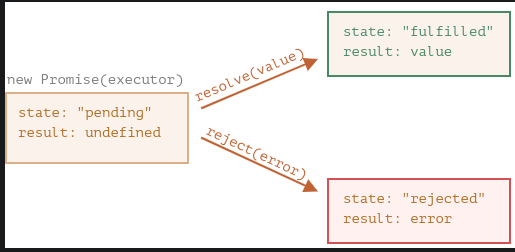
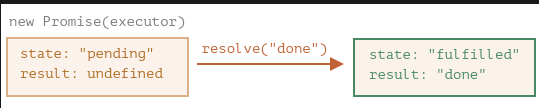
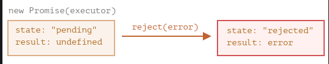

# Async learnings - Promises

## General about promises

```javascript
let promise = new Promise(function (resolve, reject) {
  // executor code
})
```

The promise object returned by the `new Promise` constructor has these internal properties:

- `state` — initially "pending", then changes to either "fulfilled" when resolve is called or "rejected" when reject is called.
- `result` — initially undefined, then changes to value when `resolve(value)` is called or error when `reject(error)` is called.

The function passed to `new Promise` is called the **executor**. When `new Promise` is created, the executor runs automatically.
It contains the producing code which should eventually produce the result.

Its arguments `resolve` and `reject` are callbacks provided by JavaScript itself. Our code is only inside the executor.

When the executor obtains the result, be it soon or late, doesn’t matter, it should call one of these callbacks:

- `resolve(value)` — if the job is finished successfully, with result value.
- `reject(error)` — if an error has occurred, error is the error object.



## Example of resolved promise

```javascript
let promise1 = new Promise(function (resolve, reject) {
  // Resolves after 3 seconds
  setTimeout(() => {
    resolve('done')
  }, 1000)
})
```



## Example of rejected promise

```javascript
let promise2 = new Promise(function(resolve, reject) {
  reject(new Error("Whoops!"))
})


```

## Consumers

The properties `state` and `result` of the Promise object are internal. We can’t directly access them. We can use the
methods `.then/.catch/.finally` for that.

### `then`

Syntax,

```javascript
promise.then(
  // "Gets" the result if promise "resolves"
  (result) => console.log(result),
  // "Gets the error if promise rejects"
  (error) => console.log(error.message)
)
```

or,

```javascript
promise2.then(
  // "Gets" the result if promise "resolves"
  function (result) {
    console.log(result)
  },
  function (error) {
    // "Gets the error if promise rejects"
    ;(error) => console.log(error.message)
    console.log(error.message)
  }
)
```

Example 1:

```javascript
let promise1 = new Promise(function (resolve, reject) {
  setTimeout(() => {
    resolve('You have waited 3 seconds to resolve')
  }, 3000)
})

promise1.then(
  (result) => console.log(result), // You have waited 3 seconds to resolve
  (error) => console.log(error.message)
)
```

Example 2:

```javascript
let promise2 = new Promise(function (resolve, reject) {
  reject(new Error('Something went wrong'))
})

promise2.then(
  function (result) {
    console.log(result)
  },
  function (error) {
    console.log(error.message) // Something went wrong
  }
)
```

### `catch()`

If we’re interested only in errors, then we can use `null` as the first argument: `.then(null, errorHandlingFunction).`
Or we can use `.catch(errorHandlingFunction)`, which is exactly the same:

```javascript
let promise1 = new Promise(function (resolve, reject) {
  setTimeout(() => {
    resolve('You have waited 3 seconds to resolve')
  }, 3000)
})

let promise2 = new Promise(function (resolve, reject) {
  reject(new Error('Something went wrong'))
})

promise2
  .then((result) => console.log(result))
  .catch((err) => console.log(err.message)) // Something went wrong

promise1
  .then((result) => console.log(result)) // You have waited 3 seconds to resolve
  .catch((err) => console.log(err.message))
```

### `finally`

The idea of finally is to set up a handler for performing cleanup/finalizing after the previous operations are complete.

E.g. stopping loading indicators, closing no longer needed connections, etc.

Think of it as a party finisher. No matter was a party good or bad, how many friends were in it, we still need (or at least should) do a cleanup after it.

Example:

```javascript
new Promise((resolve, reject) => {
    // Some code
  })
	.then(result => console.log(result))
  .catch(err => console.log(err))
  .finally(() => console.log('This runs when promise settled')
```
