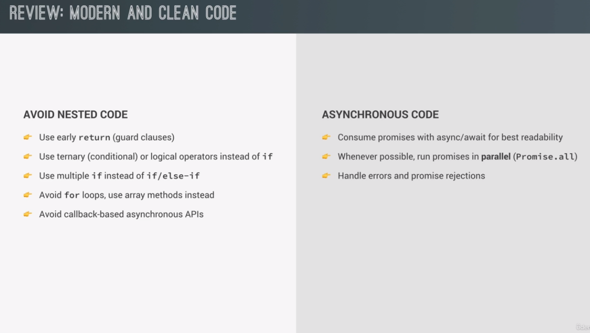

# Learnings

## Overview of modules


## Importing modules

- Note that code in the imported module will run first
- You can also only export one thing from a file by using `export default`, then you can just import it with `import
  object from 'file.js'`.
- When you import something, you get the real object, not a copy
- You can both in import and export statement use `import / export object as alias from '...'`


### index.js:

```javascript
import addToCart from './shoppingCart.js'
import {totalPrice as price, qt, cart} from './shoppingCart.js'
import * as ShoppingCart from './shoppingCart.js'

ShoppingCart.addToCart('bread, 5')
console.log(ShoppingCart.totalPrice)
console.log(price)
console.log(qt)
console.log('Import module')

addToCart('bread', 5)
addToCart('potato', 10)

console.log(cart) // bread, pizza
```

### shoppingCart.js

```javascript
// Exporting module
console.log('Exporting module')

// Private in modules
const shippingCost = 10
// Public - not global - must be imported
export const cart = []

export const addToCart = function(product, quantity) {
  cart.push({product, quantity})
  console.log(`Adding ${quantity} ${product} to cart`)
}

const totalPrice = 237
const totalQuanity = 100

export {totalPrice, totalQuanity as qt}
```

## Top-level await

Starting from `ES2022`, you can use the await keyword outside `async` functions. At least in modules.

Example of blocking code:

```javascript
// This blocks the code execution in the whole module now
console.log('Start fetching')
const res = await fetch('https://jsonplaceholder.typicode.com/')
const data = await res.json()
console.log(data)

// This is blocked
console.log('blocked')
```

Output:

```bash
Start fetching
{data}
Blocked
```

```javascript
const getLastPost = async function () {
  const res = await fetch('https://jsonplaceholder.typicode.com/posts')
  const data = await res.json()
  // Get the last element in array
  return { title: data.at(-1).title, text: data.at(-1).body }
}

console.log('Start fetching')
// Calling lastPost will return a Promise since it is a async function
// Async functions always returns Promises
const lastPost = getLastPost()
// Not very clean but works
lastPost.then((last) => console.log(last))

// const lastPost2 = await getLastPost()
// console.log(lastPost2)

console.log('Non-blocked')
```


```bash
Start fetching
Non-blocked
{data}
```

Keep in mind following problem if you have any top-level awaits in imported modules.

script.src:

```javascript
import {addToCart, cart} from './shoppingCart.js'

console.log('Main program started to run')

addToCart('Bread', 10)
addToCart('Pizza', 20)
addToCart('Kele', 30)
console.log(cart)
```


shoppingCart.js:


```javascript
console.log('Start fetching users')
const data = await fetch('https://jsonplaceholder.typicode.com/posts')
console.log('Data has been loaded')

const shippingCost = 10
export const cart = []

export const addToCart = function(product, quantity) {
  cart.push({product, quantity})
}
```

Output:

Please be aware that you should use top level await with caution since it is blocking the whole main code.


## The module pattern

## CommonJS modules

## npm

`npm init`
`npm install`

## Es modules

`lodash_es` instead of `lodash`

## commonJS vs ES modules


[Tutorial](https://blog.logrocket.com/commonjs-vs-es-modules-node-js/#:~:text=ES%20modules%20are%20the%20standard,encapsulating%20JavaScript%20code%20for%20reuse.)

## Lodash

`deepClone()`

## Parcel and NPM scripts

`npm install --save-dev parcel`

`parcel index.html` - Doesn't work

`npx parcel index.html` - Works

```javascript
if (module.hot) {
    module.got.accept()
  }
```

## Scripts in package.json

```json
"scripts": {
    "start": "parcel index.html"
    "build": "parcel build index.html"
  }
```

`npm run start` - Runs the script
`npm run build` - Compile for production (compresses)

## Configure babel and polyfilling

Parcel automatically uses babel and in cases polyfilling

## Writing clean and modern javascript




## Fix bad code
